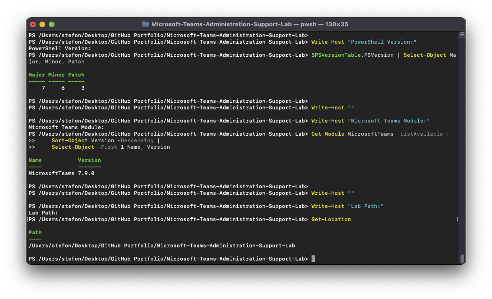
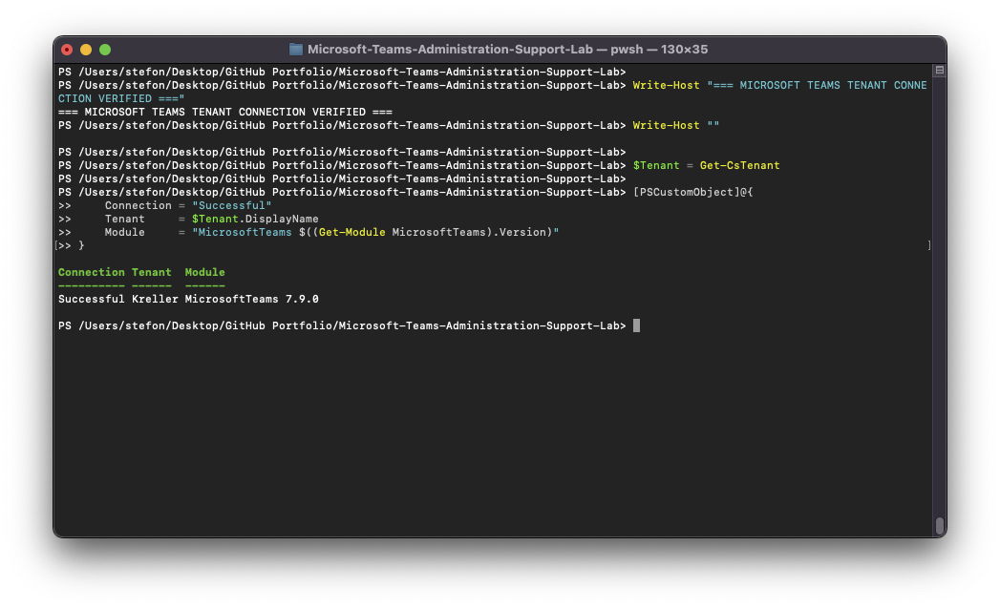
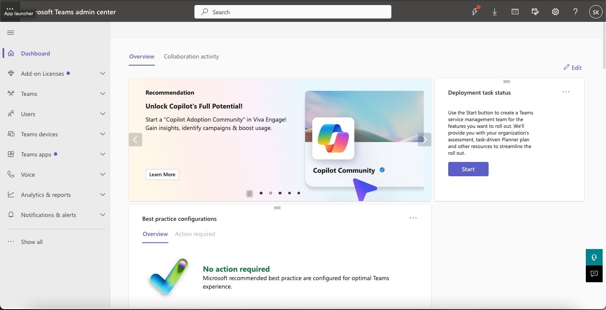
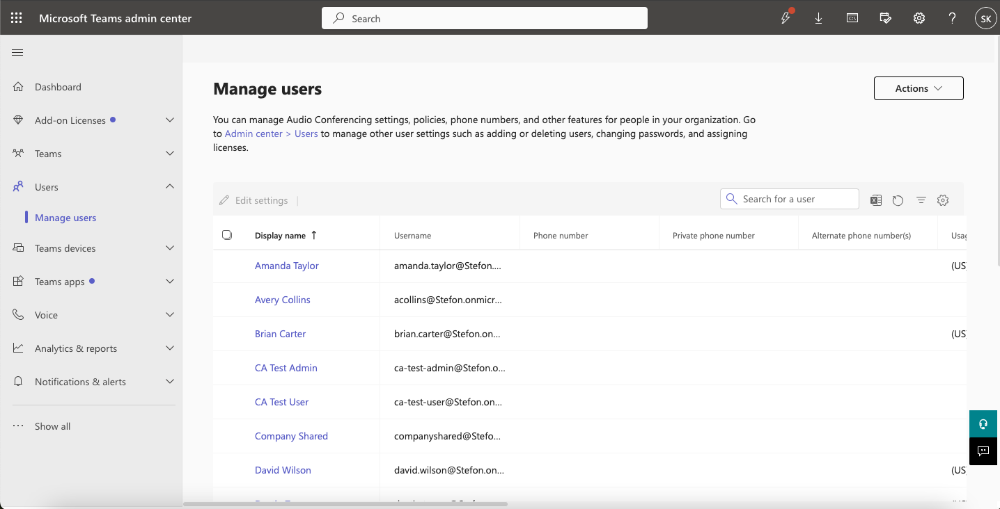
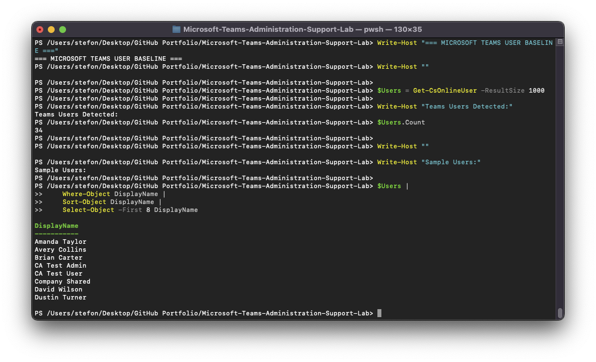
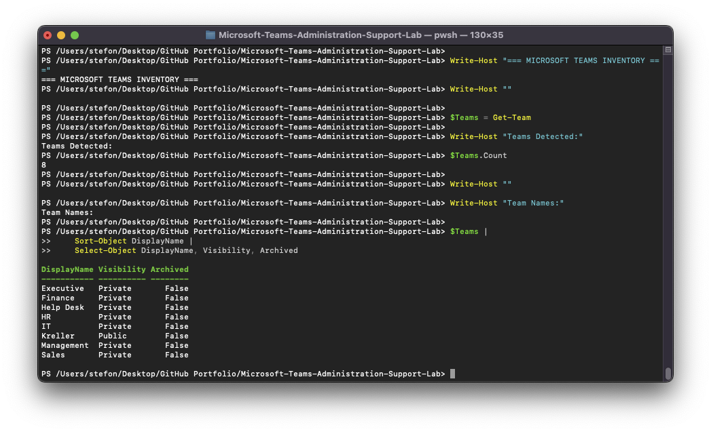

# Microsoft Teams Administration & Support Lab

## 01 — Environment Setup

## Overview

This section documents the Microsoft Teams administration environment used throughout the lab.

The environment was designed to simulate common Microsoft 365 and Microsoft Teams support responsibilities, including Teams 
administration, user and membership management, meeting and messaging policies, guest and external collaboration, Teams app 
administration, meeting diagnostics, device troubleshooting, and Microsoft Teams PowerShell.

---

## Lab Objectives

The environment was prepared to support hands-on administration and troubleshooting of:

- Microsoft Teams users
- Teams and channels
- Owners and members
- Private and standard channels
- Messaging policies
- Meeting policies
- Guest access
- External access
- Teams applications
- App setup policies
- Meetings and calls
- Client health
- Call Quality Dashboard
- Microsoft Teams PowerShell
- Real-world help desk incidents

---

## Environment

| Component | Purpose |
|---|---|
| Microsoft 365 Tenant | Primary cloud environment for Microsoft Teams administration |
| Microsoft Teams Admin Center | Teams, users, policies, apps, meetings, devices, and diagnostics |
| Microsoft Entra ID | User and guest identity administration |
| Microsoft Teams Web Client | End-user testing and meeting scenarios |
| PowerShell 7.6.3 | Administrative command-line environment |
| MicrosoftTeams 7.9.0 | Microsoft Teams PowerShell module |
| Google Chrome | Microsoft 365 and Teams administrative portals |
| macOS | Administrative workstation |
| Git | Source control |
| GitHub | Portfolio repository and project documentation |

---

## Administrative Workstation

The primary administrative workstation was a Mac running PowerShell 7.

PowerShell environment verification confirmed:

- PowerShell version: `7.6.3`
- MicrosoftTeams module version: `7.9.0`

This provided a cross-platform PowerShell environment for Microsoft Teams administration.

---

## Microsoft Teams PowerShell

The MicrosoftTeams module was verified with:

```powershell
Get-Module MicrosoftTeams -ListAvailable |
    Sort-Object Version -Descending |
    Select-Object -First 1 Name, Version
```

The Microsoft Teams tenant connection was established with:

```powershell
Connect-MicrosoftTeams -DisableWAM
```

The `-DisableWAM` option was used after the standard authentication method produced a Web Account Manager compatibility 
issue in the macOS PowerShell environment.

Tenant connectivity was then successfully verified.

---

## Tenant Connection Verification

The Microsoft Teams PowerShell connection was validated by querying tenant information.

```powershell
$Tenant = Get-CsTenant

[PSCustomObject]@{
    Connection = "Successful"
    Tenant     = $Tenant.DisplayName
    Module     = "MicrosoftTeams $((Get-Module MicrosoftTeams).Version)"
}
```

The successful query confirmed authenticated PowerShell communication with the Microsoft Teams tenant.

---

## Microsoft Teams Admin Center

The Microsoft Teams Admin Center served as the primary graphical administration interface for the project.

Administrative areas used throughout the lab included:

- Users
- Teams
- Messaging policies
- Meeting policies
- Guest access
- External access
- Teams apps
- App setup policies
- Meetings and calls
- Teams devices
- Client health
- Analytics and reports
- Call Quality Dashboard

The Teams Admin Center was used alongside PowerShell so configuration changes could be verified through both graphical and 
command-line tools.

---

## Teams User Baseline

The initial Teams user population was reviewed through both the Teams Admin Center and Microsoft Teams PowerShell.

PowerShell enumeration was performed with:

```powershell
$Users = Get-CsOnlineUser -ResultSize 1000

Write-Host "Teams Users Detected:"
$Users.Count
```

The initial baseline returned:

```text
34 Teams users
```

A representative sample of users was also reviewed to confirm that Teams identities were available for testing.

---

## Teams Inventory Baseline

The existing Teams environment was inventoried using:

```powershell
$Teams = Get-Team

$Teams |
    Sort-Object DisplayName |
    Select-Object DisplayName, Visibility, Archived
```

The tenant contained:

```text
8 Microsoft Teams
```

These existing Teams provided the basis for later membership, channel, guest, policy, and troubleshooting scenarios.

---

## Test Accounts

Amanda Taylor served as the primary end-user test account for several administrative and troubleshooting scenarios.

Additional identities were used to demonstrate:

- Team owners
- Team members
- Guest users
- Meeting participants
- External collaboration

The IT Team was used as the primary department Team for channel, membership, guest, and troubleshooting scenarios.

---

## Tools Used

### Microsoft Teams Admin Center

Used for:

- Teams administration
- User policy assignments
- Messaging policies
- Meeting policies
- Guest access
- External access
- Teams app administration
- Meeting diagnostics
- Device administration
- Client health
- Call quality analysis

### Microsoft Entra Admin Center

Used for:

- User administration
- Guest identity creation
- External identity review

### Microsoft Teams Web Client

Used for:

- End-user Teams testing
- Device configuration
- Meetings
- Microphone troubleshooting
- Browser permission testing

### Microsoft Teams PowerShell

Used for:

- Tenant verification
- User inventory
- Team inventory
- Membership verification
- Channel inventory
- Messaging policy validation
- Meeting policy validation
- App policy validation
- Guest access verification
- External federation verification
- Troubleshooting
- Post-remediation validation

---

## Screenshots

### PowerShell Teams Environment Baseline



Verifies the PowerShell version, MicrosoftTeams module version, and lab environment.

### Successful Teams Tenant Connection



Confirms successful Microsoft Teams PowerShell authentication.

### Microsoft Teams Admin Center Baseline



Documents access to the Microsoft Teams administrative portal.

### Teams User Baseline



Shows the populated Teams user administration environment.

### PowerShell User Inventory



Verifies the Teams user population through PowerShell.

### Teams Inventory



Documents the existing Microsoft Teams inventory from PowerShell.

---

## Environment Validation Summary

The baseline confirmed that:

- Microsoft Teams Admin Center was accessible.
- Microsoft Teams PowerShell authentication succeeded.
- PowerShell 7.6.3 was available.
- MicrosoftTeams 7.9.0 was installed.
- Teams users were available for testing.
- Existing Teams were available for administration.
- Microsoft Entra identities could support internal and guest scenarios.
- Teams web functionality was available for end-user testing.
- Git and GitHub were available for documentation and portfolio management.

The environment was therefore ready for the remaining administration and support exercises.

---

## Skills Demonstrated

- Microsoft Teams Admin Center
- Microsoft 365 administration
- Microsoft Entra ID
- Microsoft Teams PowerShell
- PowerShell 7
- Tenant authentication
- Teams user inventory
- Teams environment discovery
- Cross-platform administration
- Microsoft Teams support
- Technical documentation
- Git and GitHub
