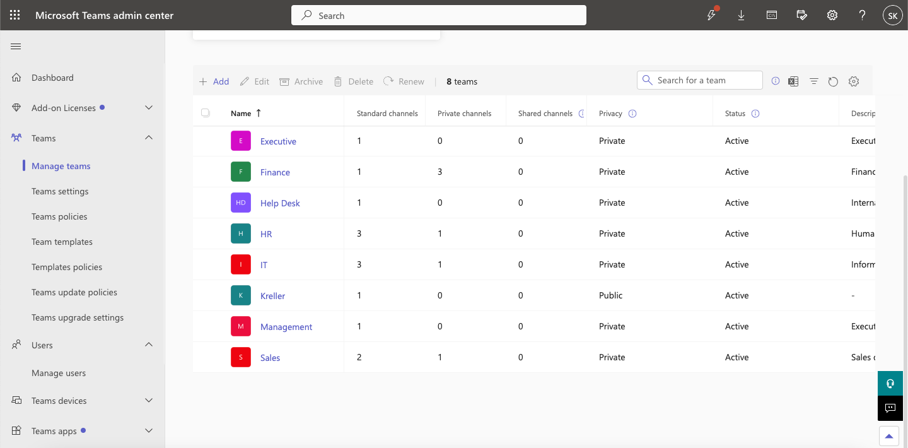
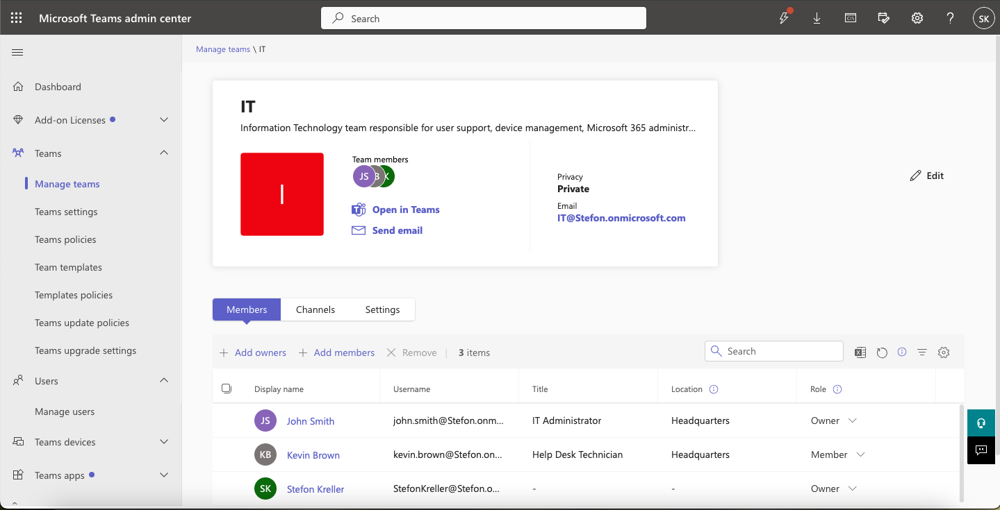
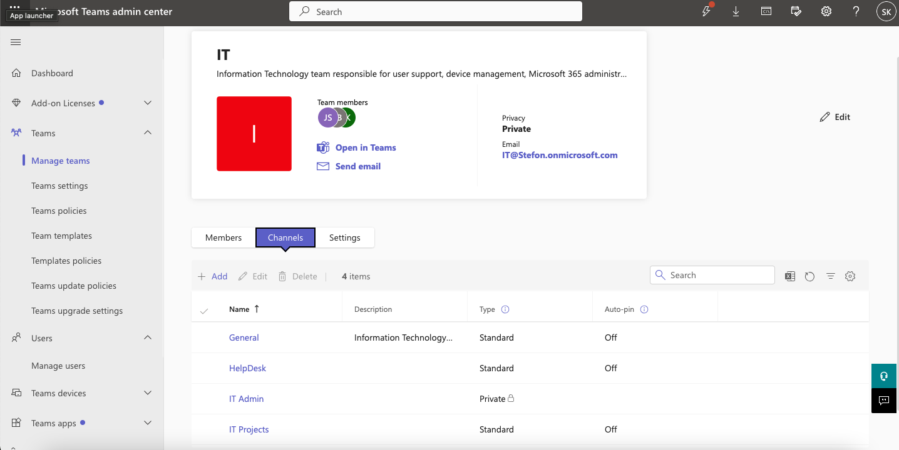
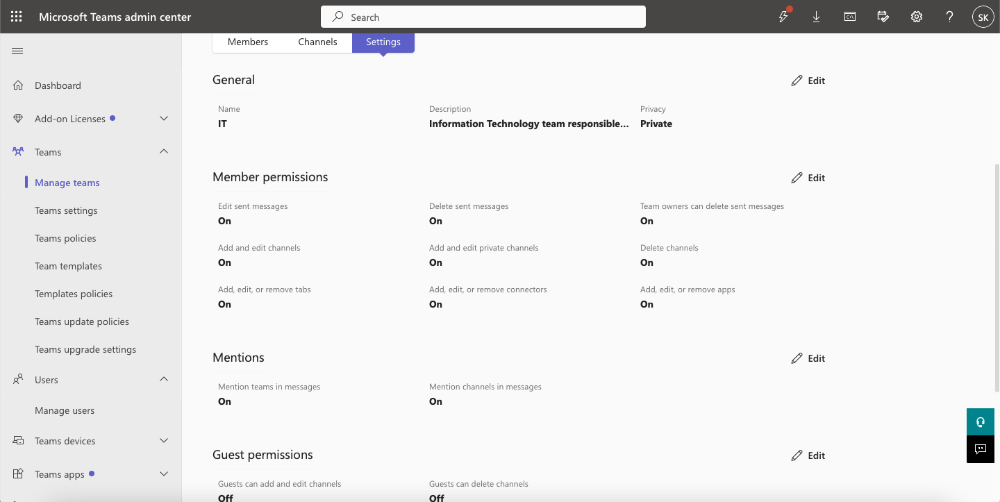
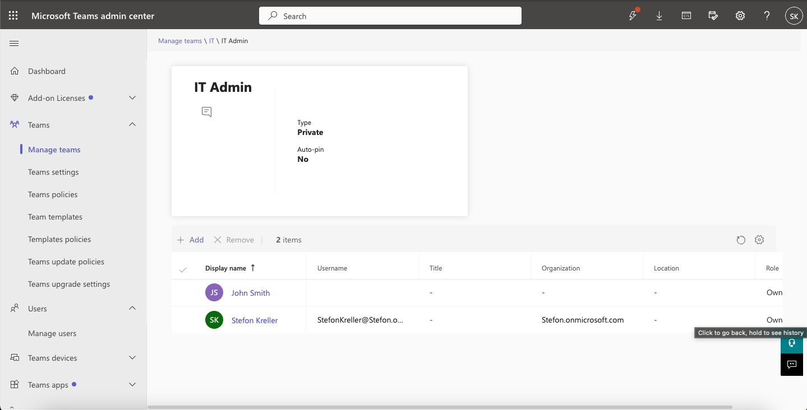
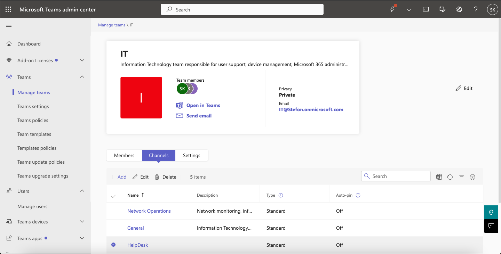
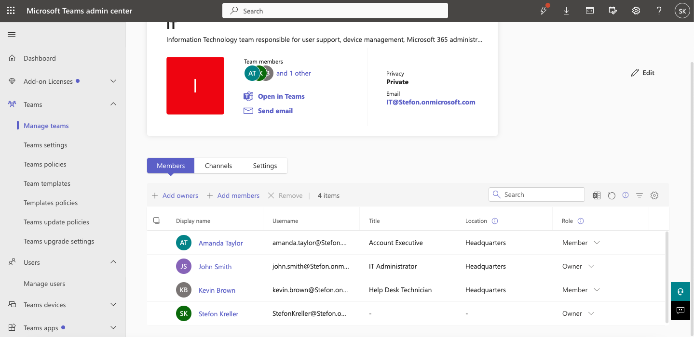
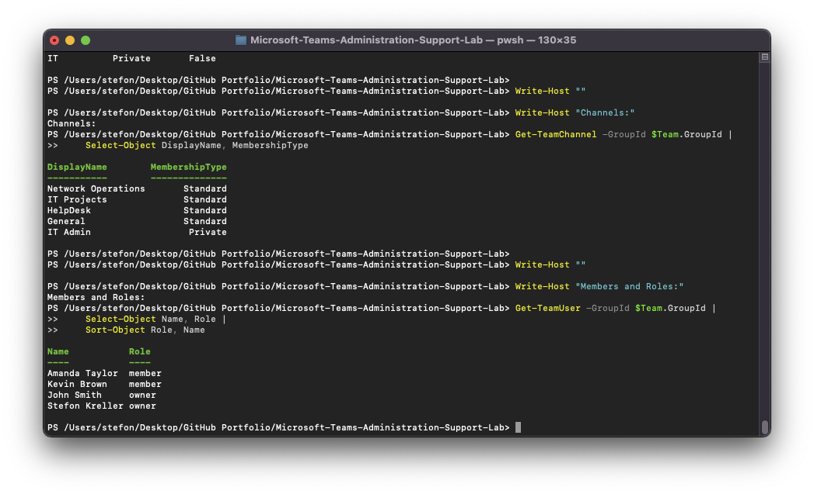

# Microsoft Teams Administration & Support Lab

## 02 — Teams & Channel Administration

## Overview

This section documents Microsoft Teams administration tasks involving Team inventory, membership management, owner and 
member roles, channel configuration, private channels, Team settings, and PowerShell verification.

The IT Team was used as the primary administrative test Team.

---

## Objectives

The objectives of this section were to demonstrate the ability to:

- Review existing Microsoft Teams
- Inspect Team configuration
- Manage Team owners and members
- Add users to Teams
- Create standard channels
- Review private channels
- Compare standard and private channel membership
- Review Team-level settings
- Verify Team configuration through Microsoft Teams PowerShell

---

## Teams Inventory

The Microsoft Teams Admin Center was used to review the existing Teams environment.

The tenant contained multiple department Teams, including:

- IT
- HR
- Sales
- Finance
- Management
- Other existing Microsoft 365 Teams

The IT Team was selected for the remainder of the administration exercises.

---

## IT Team Configuration

The IT Team was configured as:

| Setting | Value |
|---|---|
| Team Name | IT |
| Visibility | Private |
| Archived | False |
| Primary Use | IT department collaboration and support testing |

The Team contained a combination of owners and standard members.

This configuration was used to demonstrate role-based membership and administrative controls.

---

## Team Owners and Members

The IT Team membership was reviewed through the Teams Admin Center.

The environment included:

### Owners

- John Smith
- Stefon Kreller

### Members

- Kevin Brown
- Amanda Taylor

Amanda Taylor was added during the lab as a standard member rather than an owner.

This provided a user account that could later be used for Teams policy and troubleshooting scenarios.

---

## Owner vs Member Roles

Microsoft Teams uses different membership roles to control administrative access.

### Owner

A Team owner can typically:

- Add and remove members
- Promote members to owners
- Manage Team settings
- Manage channels
- Configure Team-level options
- Archive or manage the Team

### Member

A standard Team member can participate in Team collaboration but does not have the same administrative control as an owner.

The lab deliberately maintained Amanda Taylor as a standard member so later access troubleshooting scenarios could reflect a 
normal end-user role.

---

## Existing Channel Configuration

The IT Team contained the following channels:

| Channel | Membership Type |
|---|---|
| General | Standard |
| HelpDesk | Standard |
| IT Projects | Standard |
| IT Admin | Private |
| Network Operations | Standard |

This created a combination of standard and restricted collaboration spaces.

---

## Standard Channels

Standard channels are available to all members of the parent Team.

Examples in the IT Team included:

- General
- HelpDesk
- IT Projects
- Network Operations

The `Network Operations` channel was created during this lab.

### Network Operations Description

```text
Network monitoring, infrastructure support, connectivity troubleshooting, and operational coordination.
```

The channel was configured as:

```text
Standard
```

This made it available to all members of the IT Team.

---

## Private Channel

The `IT Admin` channel was configured as a private channel.

A private channel provides restricted membership inside an existing Team.

This allows organizations to maintain a broader Team while limiting certain conversations and files to selected users.

The private channel demonstrated:

- Restricted membership
- Separate channel access
- Channel-level privacy
- Administrative separation inside a Team

---

## Team Settings

The Team settings interface was reviewed to demonstrate administrative controls available to Team owners and Microsoft Teams 
administrators.

The Teams Admin Center provided options for managing Team-level behavior and configuration.

This demonstrated the difference between:

- Tenant-wide Teams configuration
- Team-specific configuration
- Channel-specific configuration
- User-specific policy assignment

---

## Adding Amanda Taylor to the IT Team

Amanda Taylor was added to the IT Team as a standard member.

This was intentionally configured as:

```text
Member
```

rather than:

```text
Owner
```

The updated membership list was reviewed in the Teams Admin Center.

Amanda Taylor was later used as the primary test account for:

- Messaging policies
- Meeting policies
- Teams app policies
- Meeting troubleshooting
- Membership troubleshooting
- Device troubleshooting

---

## PowerShell Team Verification

The IT Team was queried through Microsoft Teams PowerShell.

```powershell
$Team = Get-Team -DisplayName "IT"

$Team |
    Select-Object DisplayName, Visibility, Archived
```

This confirmed:

- Team name: IT
- Visibility: Private
- Archived: False

---

## PowerShell Channel Verification

Channels were enumerated using:

```powershell
Get-TeamChannel -GroupId $Team.GroupId |
    Select-Object DisplayName, MembershipType
```

The output confirmed the presence of both standard and private channels.

Example channel inventory:

```text
Network Operations    Standard
IT Projects           Standard
HelpDesk              Standard
General               Standard
IT Admin              Private
```

---

## PowerShell Membership Verification

Team membership was inspected using:

```powershell
Get-TeamUser -GroupId $Team.GroupId |
    Select-Object Name, Role |
    Sort-Object Role, Name
```

This provided command-line verification of:

- Team owners
- Team members
- Guest membership when later added
- User role assignments

PowerShell verification was important because it provided an independent method of confirming configuration changes made in 
the Teams Admin Center.

---

## Administrative Workflow

The administration workflow used in this section was:

```text
Teams Admin Center
        |
        v
Review Teams Inventory
        |
        v
Open IT Team
        |
        v
Review Owners and Members
        |
        v
Review Existing Channels
        |
        v
Inspect Private Channel
        |
        v
Create Network Operations Channel
        |
        v
Add Amanda Taylor as Member
        |
        v
Verify Configuration with PowerShell
```

---

## Screenshots

### Teams List Baseline



Documents the existing Teams environment in the Teams Admin Center.

---

### IT Team Members and Owners



Shows the IT Team membership and administrative roles.

---

### IT Team Channels Baseline



Documents the existing standard and private channel structure.

---

### IT Team Settings



Shows the Team-level configuration interface.

---

### IT Admin Private Channel



Demonstrates a restricted private channel within the IT Team.

---

### Network Operations Standard Channel



Documents the newly created standard Network Operations channel.

---

### Amanda Taylor Added as Member



Shows Amanda Taylor added to the IT Team as a standard member.

---

### PowerShell Verification



Provides command-line verification of Team configuration, channels, and membership.

---

## Skills Demonstrated

- Microsoft Teams administration
- Teams Admin Center
- Team membership management
- Team owner administration
- Standard channel creation
- Private channel administration
- Role-based collaboration access
- Microsoft Teams PowerShell
- Get-Team
- Get-TeamChannel
- Get-TeamUser
- Team configuration validation
- Administrative troubleshooting
- Technical documentation

---

## Result

The IT Team was successfully reviewed and expanded with a new standard channel and additional member.

The final configuration demonstrated:

- Private Team administration
- Multiple Team owners
- Standard Team members
- Standard channels
- Private channels
- Membership changes
- PowerShell-based configuration verification

This environment provided the foundation for the messaging, meeting, guest access, app policy, and troubleshooting exercises 
performed later in the lab.
