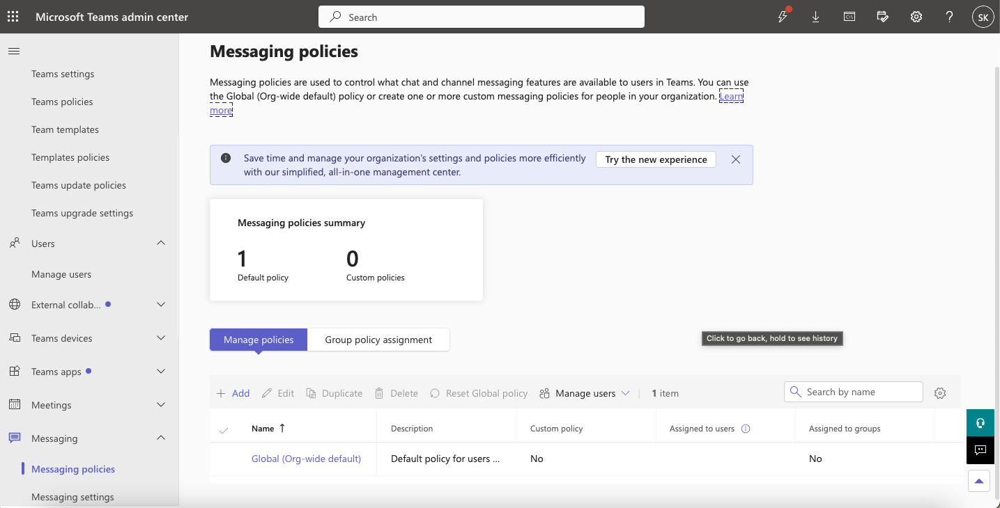
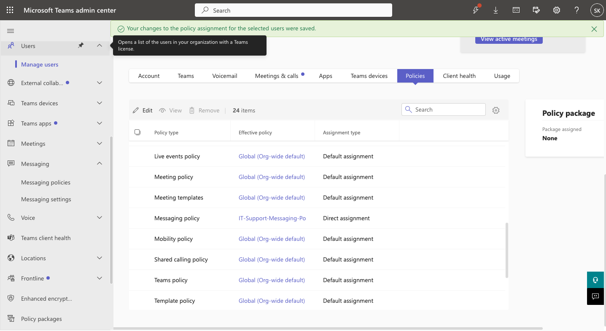

# Microsoft Teams Administration & Support Lab

## 03 — Messaging Policies

## Overview

This section documents Microsoft Teams messaging policy administration, including creation of a custom messaging policy, 
configuration of message permissions, direct user policy assignment, and PowerShell verification.

Amanda Taylor was used as the primary test user.

---

## Objectives

The objectives of this section were to demonstrate the ability to:

- Review existing Teams messaging policies
- Create a custom messaging policy
- Configure chat and message controls
- Assign a policy directly to a user
- Verify effective policy assignment
- Validate messaging policy settings with Microsoft Teams PowerShell
- Use policy configuration later in troubleshooting scenarios

---

## Messaging Policy Baseline

The Microsoft Teams Admin Center was used to review the existing messaging policy environment.

The baseline policy list included Microsoft-provided policies and tenant configuration before creation of the custom lab 
policy.

This established the starting point before making administrative changes.

---

## Custom Messaging Policy

A custom policy named:

```text
IT-Support-Messaging-Policy
```

was created.

The purpose of the policy was to demonstrate user-specific Teams messaging controls for IT support users.

### Description

```text
Custom messaging policy for IT support users demonstrating controlled Teams chat and message permissions.
```

---

## Key Messaging Policy Settings

The custom policy was configured with the following settings:

| Setting | Configuration |
|---|---|
| Chat | Enabled |
| Delete sent messages | Disabled |
| Edit sent messages | Enabled |
| Read receipts | User controlled |

These settings demonstrated how Teams administrators can control user messaging behavior without changing tenant-wide 
defaults.

---

## Chat Configuration

Chat remained enabled so the test user could continue using standard Teams chat functionality.

This allowed later troubleshooting exercises to focus on specific message capabilities instead of removing all chat access.

---

## Delete Sent Messages

The custom messaging policy was configured so users could not delete sent messages.

This demonstrated a policy-based restriction that could be applied to selected users without affecting every Teams user in 
the organization.

---

## Edit Sent Messages

Editing sent messages was initially enabled.

This capability was later used in troubleshooting ticket `TEAM-010`, where the setting was intentionally disabled, 
diagnosed, and restored.

The baseline state was:

```text
AllowUserEditMessage = True
```

---

## Read Receipts

Read receipts were configured as:

```text
User controlled
```

This allowed individual users to control their read receipt behavior while still demonstrating centralized policy 
administration.

---

## Policy Creation

The custom messaging policy was created through:

```text
Teams Admin Center
    >
Messaging
    >
Messaging policies
    >
Add
```

The administrator configured the policy and saved it to the tenant.

After creation, the custom policy appeared alongside the existing Teams messaging policies.

---

## Direct Policy Assignment

The custom policy was assigned directly to Amanda Taylor.

The assignment path was:

```text
Teams Admin Center
    >
Users
    >
Manage users
    >
Amanda Taylor
    >
Policies
```

The messaging policy was set to:

```text
IT-Support-Messaging-Policy
```

The assignment type was:

```text
Direct
```

This demonstrated targeted policy administration for a specific user.

---

## Why Direct Assignment Matters

Microsoft Teams policy behavior can be influenced by:

- Global policies
- Group policy assignments
- Direct user assignments

Direct assignment was used in this lab so the relationship between Amanda Taylor and the custom policy could be clearly 
demonstrated and verified.

This also created a predictable environment for later troubleshooting exercises.

---

## PowerShell Policy Verification

The assigned messaging policy was reviewed using Microsoft Teams PowerShell.

The user was located with:

```powershell
$User = Get-CsOnlineUser -ResultSize 1000 |
    Where-Object DisplayName -eq "Amanda Taylor" |
    Select-Object -First 1
```

The user's messaging policy was reviewed with:

```powershell
$User |
    Select-Object DisplayName, TeamsMessagingPolicy
```

---

## Messaging Policy Configuration Verification

The custom policy itself was inspected using:

```powershell
Get-CsTeamsMessagingPolicy -Identity "IT-Support-Messaging-Policy" |
    Select-Object Identity,
                  AllowUserChat,
                  AllowUserDeleteMessage,
                  AllowUserEditMessage,
                  ReadReceiptsEnabledType
```

The output provided command-line validation of the settings configured through the Teams Admin Center.

---

## Effective Policy Verification

Effective policy assignments were also reviewed during the lab.

Example:

```powershell
$User.EffectivePolicyAssignments |
    Where-Object PolicyType -eq "TeamsMessagingPolicy"
```

This provided additional confirmation that the custom policy was being applied to Amanda Taylor.

---

## Policy Administration Workflow

The workflow used in this section was:

```text
Review Existing Messaging Policies
        |
        v
Create IT-Support-Messaging-Policy
        |
        v
Configure Chat and Message Controls
        |
        v
Save Custom Policy
        |
        v
Assign Policy Directly to Amanda Taylor
        |
        v
Verify Assignment in Teams Admin Center
        |
        v
Verify Policy with PowerShell
```

---

## Troubleshooting Relevance

Messaging policies are a common source of Teams support incidents.

Potential issues include:

- User cannot edit sent messages
- User cannot delete messages
- Chat functionality unavailable
- Read receipt behavior differs from expectations
- User receives wrong messaging policy
- Direct and Global policies conflict with expectations

This custom policy was later used in:

```text
TEAM-010 — User Cannot Edit Sent Teams Messages
```

That incident demonstrated how a messaging policy setting could directly affect end-user functionality.

---

## Screenshots

### Messaging Policies Baseline



Documents the messaging policy environment before custom policy creation.

---

### Custom Messaging Policy Configuration


Shows the custom messaging policy configuration.

---

### Custom Messaging Policy Created


Confirms that `IT-Support-Messaging-Policy` was successfully created.

---

### Amanda Taylor Policy Assignment



Shows the custom policy assigned directly to Amanda Taylor.

---

### PowerShell Verification


Provides command-line verification of the policy assignment and configuration.

---

## Related Troubleshooting Ticket

The messaging policy configuration was later used in:

[TEAM-010 — Message Editing Disabled](../Help-Desk-Tickets/TEAM-010-Message-Editing-Disabled.md)

During that incident:

1. Message editing was initially enabled.
2. `Edit sent messages` was disabled.
3. PowerShell confirmed `AllowUserEditMessage = False`.
4. The policy was corrected.
5. PowerShell confirmed `AllowUserEditMessage = True`.
6. The ticket was resolved.

This connected routine policy administration directly to a realistic support workflow.

---

## Skills Demonstrated

- Microsoft Teams messaging policy administration
- Teams Admin Center
- Custom policy creation
- Direct user policy assignment
- Chat controls
- Message editing controls
- Message deletion controls
- Read receipt configuration
- Microsoft Teams PowerShell
- Get-CsTeamsMessagingPolicy
- Get-CsOnlineUser
- Effective policy validation
- Policy troubleshooting
- Technical documentation

---

## Result

A custom Microsoft Teams messaging policy was successfully created and assigned directly to Amanda Taylor.

The configuration demonstrated targeted control over:

- Chat
- Sent-message deletion
- Sent-message editing
- Read receipts

The policy was verified through both the Teams Admin Center and Microsoft Teams PowerShell.

This configuration also provided the foundation for a later messaging support incident in which a user-facing problem was 
traced to a policy setting and successfully remediated.
