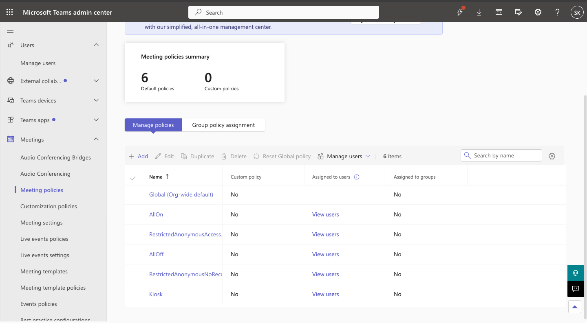
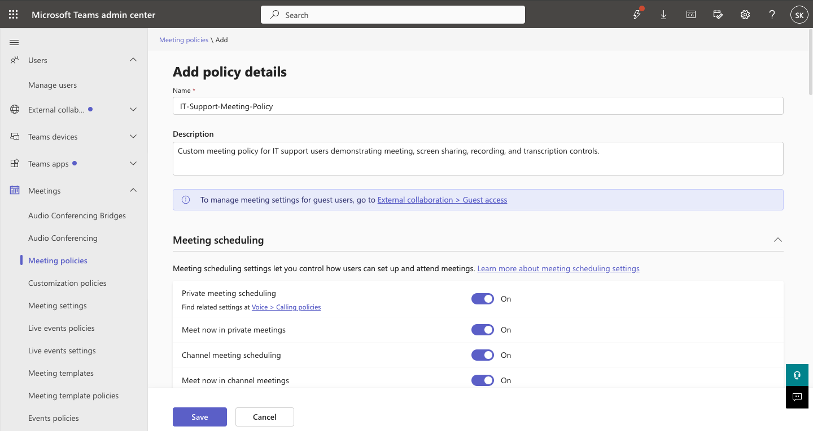
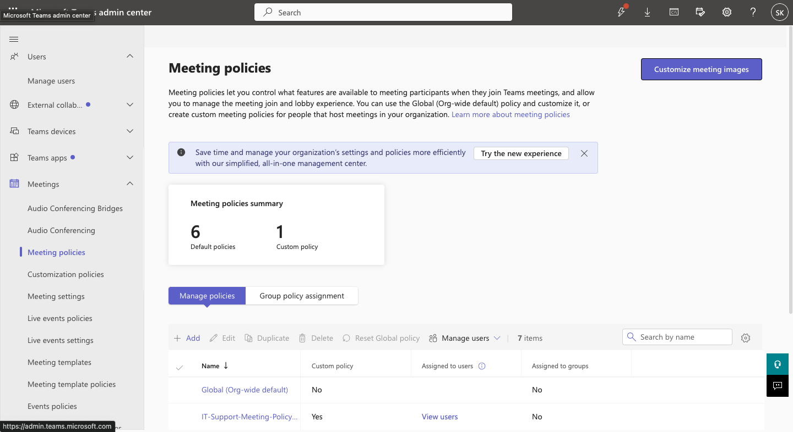
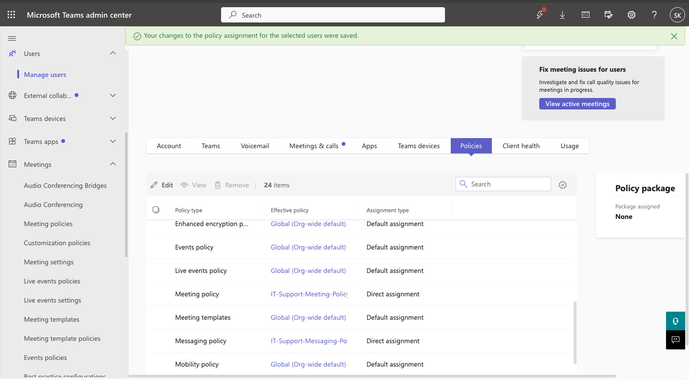
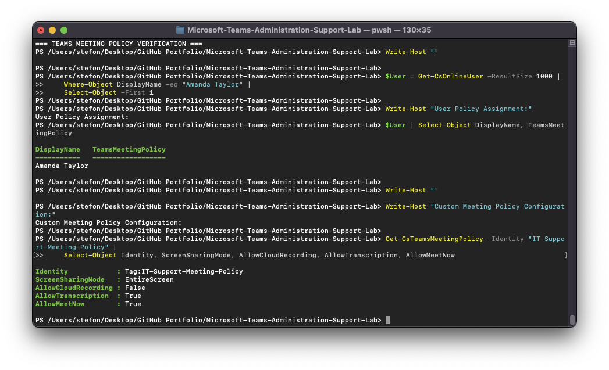

# Microsoft Teams Administration & Support Lab

## 04 — Meeting Policies

## Overview

This section documents Microsoft Teams meeting policy administration, including creation of a custom meeting policy, 
configuration of scheduling, screen sharing, recording, transcription, and direct user policy assignment.

Amanda Taylor was used as the primary test user.

The custom meeting policy created in this section was later used in several troubleshooting scenarios involving meeting 
creation, screen sharing, and meeting recording.

---

## Objectives

The objectives of this section were to demonstrate the ability to:

- Review existing Teams meeting policies
- Create a custom meeting policy
- Configure meeting scheduling
- Configure screen sharing
- Configure cloud recording
- Configure transcription
- Configure Meet Now functionality
- Assign a meeting policy directly to a user
- Verify policy configuration with Microsoft Teams PowerShell
- Use meeting policy settings in realistic troubleshooting scenarios

---

## Meeting Policy Baseline

The Microsoft Teams Admin Center was used to review the existing meeting policy environment.

The baseline policy list contained Microsoft-provided and tenant-level policies before the custom lab policy was created.

This established the starting point for later comparison and troubleshooting.

---

## Custom Meeting Policy

A custom meeting policy named:

```text
IT-Support-Meeting-Policy
```

was created.

### Description

```text
Custom meeting policy for IT support users demonstrating meeting, screen sharing, recording, and transcription controls.
```

This policy was designed to provide a controlled test configuration for common Microsoft Teams meeting features.

---

## Key Meeting Policy Settings

The custom policy included the following important settings:

| Setting | Configuration |
|---|---|
| Private meeting scheduling | Enabled |
| Screen sharing mode | Entire screen |
| Cloud meeting recording | Disabled initially |
| Transcription | Enabled |
| Meet Now | Enabled |

These settings were selected so multiple realistic support scenarios could later be reproduced and diagnosed.

---

## Private Meeting Scheduling

Private meeting scheduling was enabled in the baseline custom policy.

The corresponding PowerShell property was:

```text
AllowPrivateMeetingScheduling = True
```

This allowed Amanda Taylor to create and schedule private Teams meetings.

This setting was later used in:

```text
TEAM-002 — User Cannot Schedule Private Teams Meetings
```

During that ticket, private meeting scheduling was intentionally disabled, diagnosed through PowerShell, and restored.

---

## Screen Sharing

The custom meeting policy allowed:

```text
Entire screen
```

screen sharing.

PowerShell represented this as:

```text
ScreenSharingMode = EntireScreen
```

This baseline setting was later used in:

```text
TEAM-005 — Screen Sharing Disabled During Teams Meetings
```

During that incident, screen sharing was changed to `Disabled`, the policy restriction was identified, and `EntireScreen` 
sharing was restored.

---

## Cloud Meeting Recording

The policy initially had cloud meeting recording disabled.

PowerShell represented the setting as:

```text
AllowCloudRecording = False
```

This created a realistic support condition for:

```text
TEAM-006 — User Cannot Record Microsoft Teams Meetings
```

The affected configuration was diagnosed and later corrected by enabling cloud recording.

---

## Transcription

Meeting transcription was enabled.

PowerShell represented the setting as:

```text
AllowTranscription = True
```

This demonstrated how Teams administrators can independently manage recording and transcription capabilities.

---

## Meet Now

Meet Now functionality was enabled.

PowerShell validation showed:

```text
AllowMeetNow = True
```

This demonstrated additional meeting control through user policy configuration.

---

## Policy Creation

The custom meeting policy was created through:

```text
Teams Admin Center
    >
Meetings
    >
Meeting policies
    >
Add
```

The administrator configured the policy and saved it.

After creation, the custom policy appeared in the meeting policy list.

---

## Direct Policy Assignment

The policy was assigned directly to Amanda Taylor.

The assignment path was:

```text
Teams Admin Center
    >
Users
    >
Manage users
    >
Amanda Taylor
    >
Policies
```

The Meeting policy field was configured as:

```text
IT-Support-Meeting-Policy
```

The assignment type was:

```text
Direct
```

This ensured that the test account consistently received the custom meeting configuration.

---

## PowerShell User Verification

Amanda Taylor was located using:

```powershell
$User = Get-CsOnlineUser -ResultSize 1000 |
    Where-Object DisplayName -eq "Amanda Taylor" |
    Select-Object -First 1
```

Her meeting policy was reviewed with:

```powershell
$User |
    Select-Object DisplayName, TeamsMeetingPolicy
```

This provided command-line verification of the user policy assignment.

---

## PowerShell Meeting Policy Verification

The custom meeting policy was queried using:

```powershell
Get-CsTeamsMeetingPolicy -Identity "IT-Support-Meeting-Policy" |
    Select-Object Identity,
                  ScreenSharingMode,
                  AllowCloudRecording,
                  AllowTranscription,
                  AllowMeetNow
```

The baseline verification showed the key configuration used throughout the lab.

---

## Effective Policy Assignment Verification

The user's effective meeting policy could also be reviewed through:

```powershell
$User.EffectivePolicyAssignments |
    Where-Object PolicyType -eq "TeamsMeetingPolicy"
```

This was useful during troubleshooting because it confirmed that Amanda Taylor was actually subject to the policy being 
investigated.

---

## Policy Administration Workflow

The workflow used in this section was:

```text
Review Meeting Policies
        |
        v
Create IT-Support-Meeting-Policy
        |
        v
Configure Scheduling
        |
        v
Configure Screen Sharing
        |
        v
Configure Recording and Transcription
        |
        v
Save Policy
        |
        v
Assign Policy to Amanda Taylor
        |
        v
Verify Assignment
        |
        v
Validate with PowerShell
```

---

## Troubleshooting Relevance

Meeting policies directly affect several common Teams support issues.

Examples include:

- User cannot schedule meetings
- User cannot share screen
- User cannot record meetings
- User cannot start Meet Now sessions
- User cannot use transcription
- User has different meeting capabilities than coworkers
- Policy assignment does not match expectations

The custom meeting policy in this lab was intentionally used in multiple support incidents.

---

## Related Troubleshooting Tickets

### TEAM-002 — Meeting Scheduling Disabled

[TEAM-002 — Meeting Scheduling Disabled](../Help-Desk-Tickets/TEAM-002-Meeting-Scheduling-Disabled.md)

This incident demonstrated:

```text
AllowPrivateMeetingScheduling
True -> False -> True
```

---

### TEAM-005 — Screen Sharing Disabled

[TEAM-005 — Screen Sharing Disabled](../Help-Desk-Tickets/TEAM-005-Screen-Sharing-Disabled.md)

This incident demonstrated:

```text
ScreenSharingMode
EntireScreen -> Disabled -> EntireScreen
```

---

### TEAM-006 — Meeting Recording Disabled

[TEAM-006 — Meeting Recording Disabled](../Help-Desk-Tickets/TEAM-006-Meeting-Recording-Disabled.md)

This incident demonstrated:

```text
AllowCloudRecording
False -> True
```

---

## Screenshots

### Meeting Policies Baseline



Documents the existing Teams meeting policy environment.

---

### Custom Meeting Policy Configuration



Shows the custom `IT-Support-Meeting-Policy` configuration.

---

### Custom Meeting Policy Created



Confirms that the custom meeting policy was successfully created.

---

### Amanda Taylor Meeting Policy Assignment



Shows the custom meeting policy assigned directly to Amanda Taylor.

---

### PowerShell Meeting Policy Verification



Provides command-line verification of the user policy and key meeting settings.

---

## Skills Demonstrated

- Microsoft Teams meeting policy administration
- Teams Admin Center
- Custom meeting policy creation
- Private meeting scheduling
- Screen sharing controls
- Cloud meeting recording controls
- Transcription controls
- Meet Now configuration
- Direct user policy assignment
- Microsoft Teams PowerShell
- Get-CsTeamsMeetingPolicy
- Get-CsOnlineUser
- Effective policy analysis
- Meeting policy troubleshooting
- Technical documentation

---

## Result

A custom Microsoft Teams meeting policy was successfully created and assigned directly to Amanda Taylor.

The policy provided controlled settings for:

- Meeting scheduling
- Screen sharing
- Recording
- Transcription
- Meet Now functionality

The configuration was verified through both the Teams Admin Center and Microsoft Teams PowerShell.

The policy then became the foundation for several realistic support incidents, demonstrating how Teams meeting policy 
settings can directly affect end-user functionality and how administrators can diagnose and remediate those issues.
