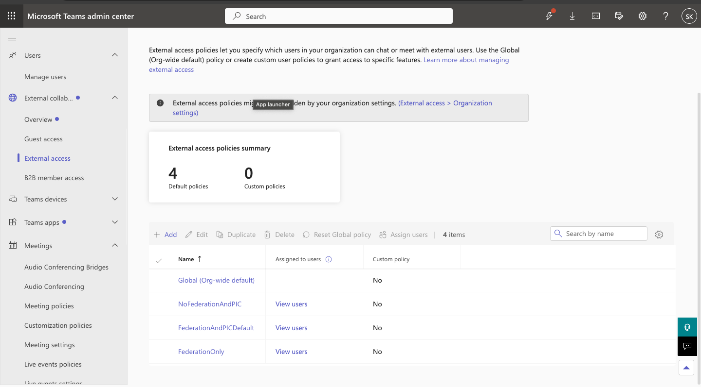
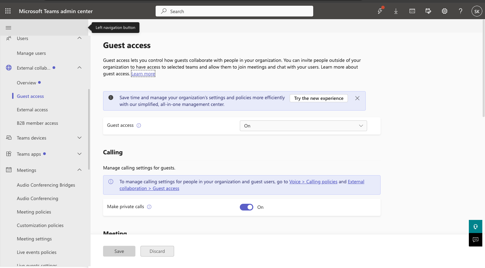
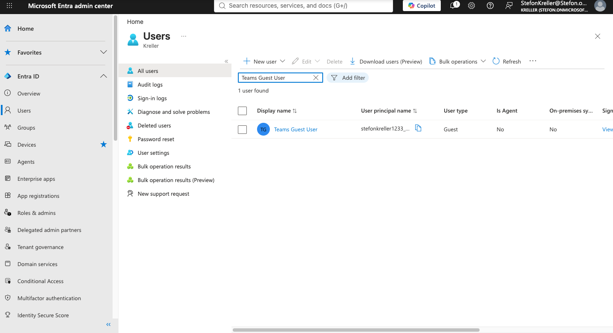
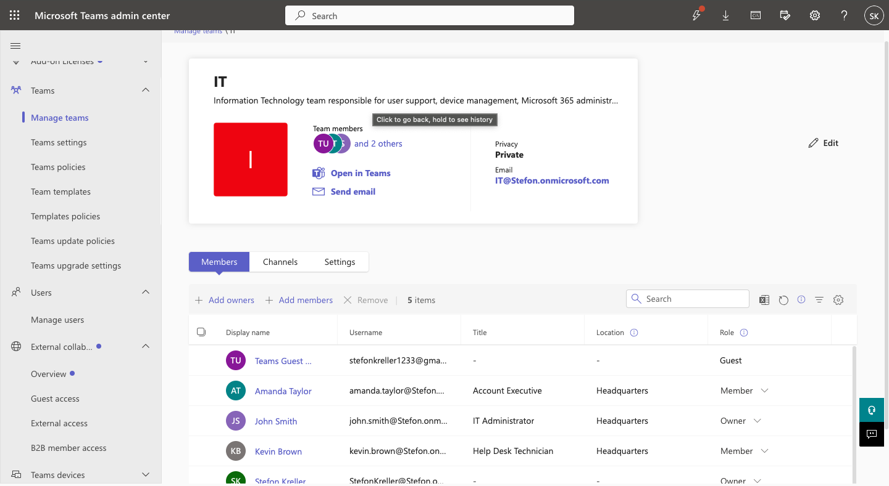
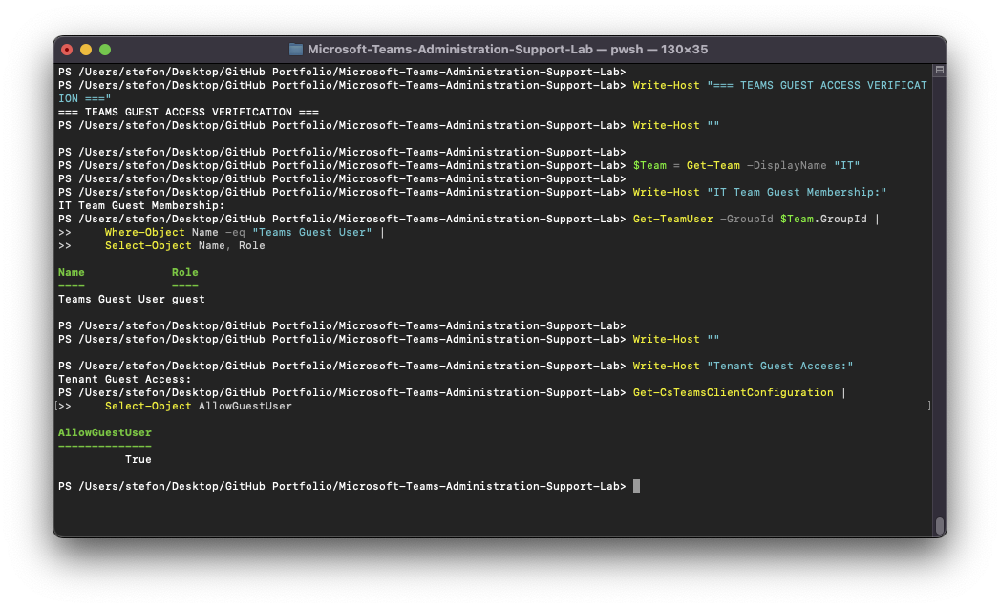

# Microsoft Teams Administration & Support Lab

## 05 — Guest & External Access

## Overview

This section documents Microsoft Teams guest access and external collaboration administration.

The lab demonstrates the difference between guest access and external access, creation of a Microsoft Entra guest identity, 
Team guest membership, tenant-wide guest configuration, external federation settings, and PowerShell verification.

These configurations were later used in troubleshooting scenarios involving guest collaboration and external chat.

---

## Objectives

The objectives of this section were to demonstrate the ability to:

- Review Teams external access settings
- Review Teams guest access settings
- Create a guest identity in Microsoft Entra ID
- Add a guest user to a Microsoft Team
- Verify guest Team membership
- Verify tenant-wide guest access
- Review Teams external federation configuration
- Distinguish guest access from external access
- Use Microsoft Teams PowerShell for validation
- Troubleshoot collaboration issues

---

## Guest Access vs External Access

Microsoft Teams supports multiple forms of collaboration with users outside the organization.

### Guest Access

Guest access allows an external identity to be added into the tenant and then added to a Team.

A guest user can participate in Team collaboration according to the permissions provided by the organization.

Guest collaboration may include:

- Team membership
- Channel access
- Chat
- Meetings
- File collaboration
- Application access, depending on configuration

Guest identities are represented in Microsoft Entra ID as:

```text
User type: Guest
```

---

### External Access

External access allows Teams users in one organization to communicate with Teams users in another organization without 
adding those users as guests inside a Team.

External access is commonly used for:

- External chat
- Presence
- Teams-to-Teams communication
- Federation between organizations

This configuration is separate from Team guest membership.

---

## External Access Baseline

The Teams Admin Center was used to review:

```text
External collaboration
    >
External access
```

The baseline configuration allowed external domain communication.

The tenant was configured to permit communication with external domains rather than restricting communication to a manually 
defined domain list.

External Microsoft account communication was also reviewed.

---

## Guest Access Baseline

The Teams Admin Center was used to review:

```text
External collaboration
    >
Guest access
```

Tenant-wide guest access was enabled.

PowerShell later confirmed:

```text
AllowGuestUser = True
```

This established that guest collaboration was permitted at the Teams tenant level.

---

## Creating a Guest Identity

A guest identity was created through Microsoft Entra ID.

The administrative workflow was:

```text
Microsoft Entra Admin Center
        >
Identity
        >
Users
        >
All users
        >
New user
        >
Invite external user
```

The guest identity used in the lab was:

```text
Teams Guest User
```

The created identity was verified as an external guest account.

---

## Adding the Guest to the IT Team

The new guest account was added to the IT Team.

The workflow was:

```text
Teams Admin Center
        >
Teams
        >
Manage teams
        >
IT
        >
Members
        >
Add members
```

The user was added as:

```text
Teams Guest User
```

The membership role appeared as:

```text
guest
```

This demonstrated that Microsoft Teams recognizes guest identities differently from standard internal Team members.

---

## Guest Membership Verification

The IT Team was queried using Microsoft Teams PowerShell.

```powershell
$Team = Get-Team -DisplayName "IT"

Get-TeamUser -GroupId $Team.GroupId |
    Where-Object Name -eq "Teams Guest User" |
    Select-Object Name, Role
```

This confirmed that the guest identity had been successfully added to the Team.

---

## Tenant Guest Configuration Verification

Tenant guest access was verified using:

```powershell
Get-CsTeamsClientConfiguration |
    Select-Object AllowGuestUser
```

The normal configuration returned:

```text
AllowGuestUser = True
```

This confirmed that Teams guest collaboration was enabled at the tenant level.

---

## External Federation Verification

Teams external federation was reviewed with:

```powershell
Get-CsTenantFederationConfiguration |
    Select-Object AllowFederatedUsers, AllowTeamsConsumer
```

This command was later used during external chat troubleshooting.

The configuration helped distinguish:

- Guest Team access
- Teams federation
- External user chat
- Microsoft consumer Teams communication

---

## Administrative Workflow

The guest and external access workflow used in this section was:

```text
Review External Access
        |
        v
Review Guest Access
        |
        v
Create Microsoft Entra Guest Identity
        |
        v
Add Guest to IT Team
        |
        v
Verify Guest Membership
        |
        v
Verify Tenant Guest Access with PowerShell
        |
        v
Review External Federation Configuration
```

---

## Troubleshooting Relevance

Guest and external collaboration depend on multiple layers of configuration.

A user may experience a collaboration issue even when their account exists correctly.

Possible causes include:

- Guest access disabled at the tenant level
- Guest not added to the required Team
- External access restricted
- Federation disabled
- External domain blocked
- Incorrect guest permissions
- Identity invitation not completed
- User using external access when guest access is required
- User using guest access when federation is expected

The lab intentionally separated these concepts so each could be diagnosed independently.

---

## Related Troubleshooting Ticket — TEAM-003

[TEAM-003 — Guest Access Disabled](../Help-Desk-Tickets/TEAM-003-Guest-Access-Disabled.md)

During this incident:

1. The guest remained a member of the IT Team.
2. Tenant guest access was disabled.
3. PowerShell confirmed `AllowGuestUser = False`.
4. The issue was traced to tenant-wide guest configuration rather than Team membership.
5. Guest access was restored.
6. PowerShell confirmed `AllowGuestUser = True`.
7. The ticket was resolved.

This demonstrated the importance of checking both membership and tenant configuration.

---

## Related Troubleshooting Ticket — TEAM-004

[TEAM-004 — External Chat Restricted](../Help-Desk-Tickets/TEAM-004-External-Chat-Restricted.md)

During this incident:

1. External collaboration settings were reviewed.
2. Teams federation was restricted.
3. PowerShell confirmed `AllowFederatedUsers = False`.
4. External communication was restored.
5. PowerShell confirmed `AllowFederatedUsers = True`.
6. The ticket was resolved.

This demonstrated the difference between external Teams federation and guest Team membership.

---

## Screenshots

### External Access Baseline



Documents the initial external collaboration configuration.

---

### Guest Access Baseline



Shows that Microsoft Teams guest access was enabled.

---

### Guest User Created



Documents the external guest identity created in Microsoft Entra ID.

---

### Guest User Added to IT Team



Shows the guest identity added to the IT Team.

---

### PowerShell Guest Verification



Verifies the guest Team membership and tenant guest configuration through PowerShell.

---

## Skills Demonstrated

- Microsoft Teams guest access
- Microsoft Teams external access
- Microsoft Entra guest identities
- External collaboration
- Team guest membership
- Tenant guest configuration
- Teams federation
- Microsoft Teams PowerShell
- Get-TeamUser
- Get-CsTeamsClientConfiguration
- Get-CsTenantFederationConfiguration
- Guest access troubleshooting
- External chat troubleshooting
- Identity and access administration
- Technical documentation

---

## Result

The lab successfully demonstrated both Microsoft Teams guest collaboration and external access administration.

A Microsoft Entra guest identity was created and added to the IT Team.

Tenant guest access was verified through Microsoft Teams PowerShell, and external federation configuration was reviewed 
separately.

The configuration provided the foundation for two realistic support scenarios:

- Guest user unable to access Teams
- External user unable to communicate through Teams

These exercises demonstrated how collaboration issues can originate from different layers of Microsoft Teams and Microsoft 
Entra configuration and how administrators can isolate the correct root cause.
