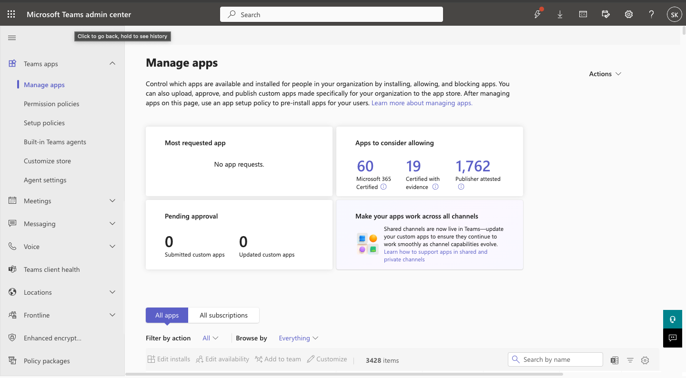
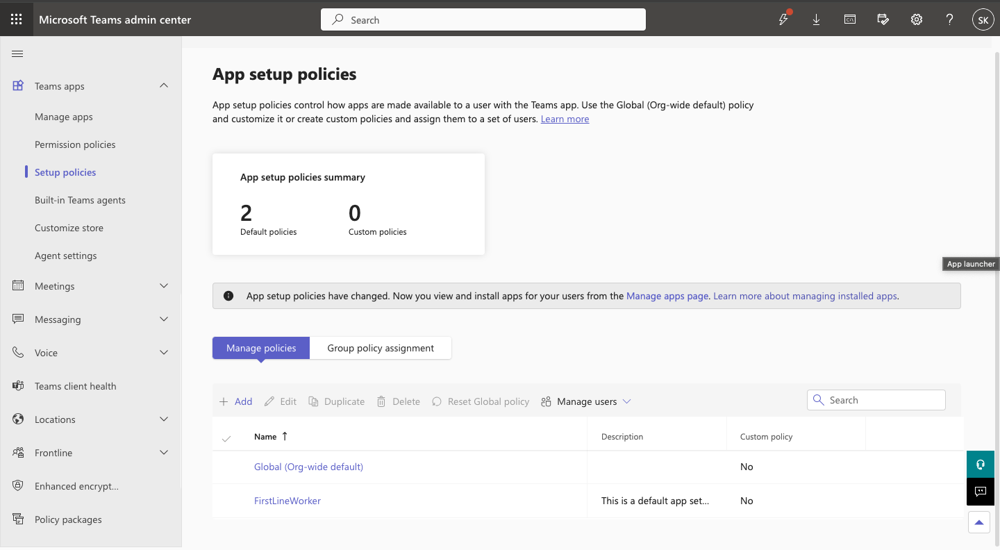
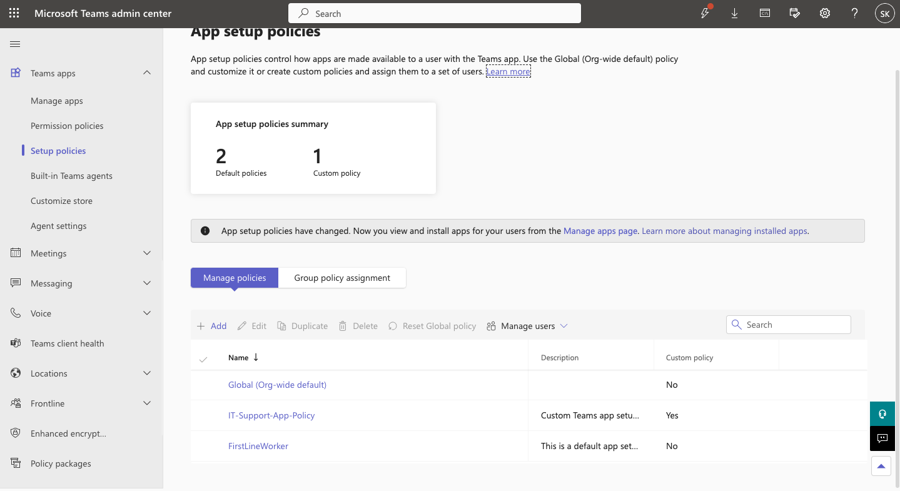
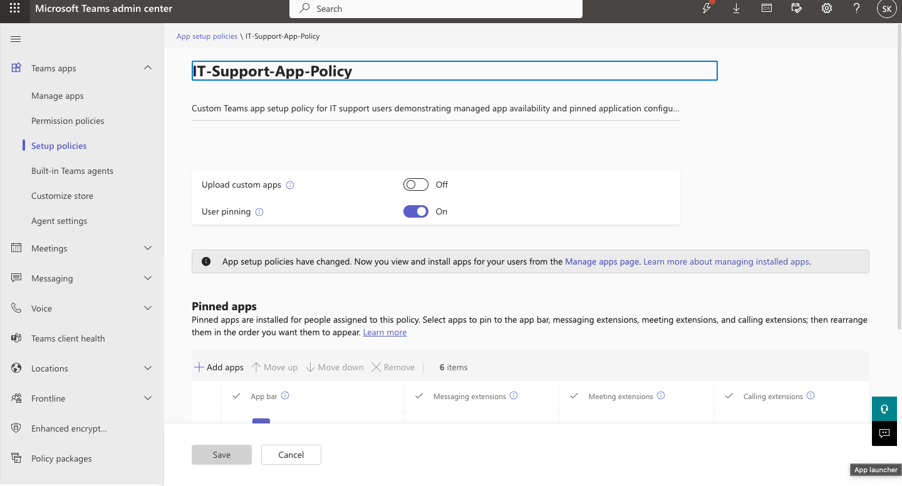
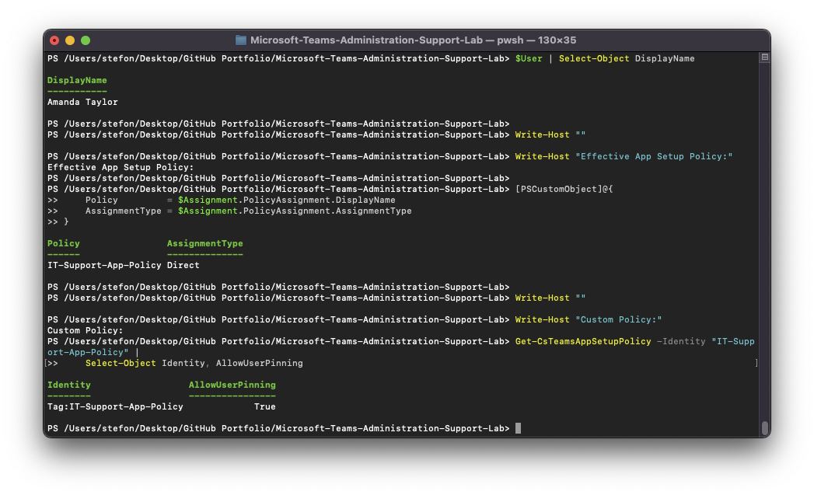

# Microsoft Teams Administration & Support Lab

## 06 — Teams Apps & Permissions

## Overview

This section documents Microsoft Teams app administration, including review of available Teams applications, creation of a 
custom app setup policy, direct user assignment, and PowerShell verification.

The goal was to demonstrate how Teams administrators control which applications are available, pinned, and assigned to users 
through centralized policy management.

Amanda Taylor was used as the primary test user.

---

## Objectives

The objectives of this section were to demonstrate the ability to:

- Review available Microsoft Teams apps
- Review existing app setup policies
- Create a custom Teams app setup policy
- Configure pinned applications
- Configure user pinning
- Assign an app setup policy directly to a user
- Verify effective app policy assignments
- Validate custom app policy configuration through PowerShell
- Troubleshoot incorrect app policy assignment

---

## Teams Apps Management Baseline

The Microsoft Teams Admin Center was used to review:

```text
Teams apps
    >
Manage apps
```

This interface provided visibility into the applications available in the tenant.

The app management area demonstrated that Teams administrators can centrally review and control application availability.

---

## App Setup Policies

The existing Teams app setup policy environment was reviewed through:

```text
Teams apps
    >
Setup policies
```

This established the baseline before the custom lab policy was created.

App setup policies can control which applications are pinned for users and how Teams presents those apps in the client.

---

## Custom App Setup Policy

A custom policy named:

```text
IT-Support-App-Policy
```

was created.

### Description

```text
Custom Teams app setup policy for IT support users demonstrating managed app availability and pinned application 
configuration.
```

This policy was designed to provide a controlled application experience for selected IT support users.

---

## Pinned Applications

The custom policy included pinned Teams applications.

Pinned applications make commonly used services easier for users to access from the Teams navigation interface.

The policy demonstrated how administrators can create a standardized app experience for specific users.

---

## User Pinning

User pinning remained enabled.

This allowed the user to retain some control over their own Teams navigation while still receiving administrator-defined 
application configuration.

This demonstrated the balance between:

- Organization-managed app configuration
- User customization
- Centralized policy control

---

## Policy Creation

The custom app setup policy was created through:

```text
Teams Admin Center
    >
Teams apps
    >
Setup policies
    >
Add
```

The administrator configured:

- Policy name
- Policy description
- Pinned applications
- User pinning behavior

The policy was then saved to the tenant.

---

## Policy Assignment

The custom app setup policy was assigned directly to Amanda Taylor.

The administrative path was:

```text
Teams Admin Center
    >
Users
    >
Manage users
    >
Amanda Taylor
    >
Policies
```

The App setup policy was set to:

```text
IT-Support-App-Policy
```

The assignment type was:

```text
Direct
```

---

## Why Direct Policy Assignment Was Used

Microsoft Teams policy behavior may be affected by:

- Global policies
- Group assignments
- Direct assignments

A direct assignment was used so the lab could clearly demonstrate which app setup policy applied to Amanda Taylor.

This also created a predictable configuration for later troubleshooting.

---

## PowerShell User Verification

Amanda Taylor was located using:

```powershell
$User = Get-CsOnlineUser -ResultSize 1000 |
    Where-Object DisplayName -eq "Amanda Taylor" |
    Select-Object -First 1
```

The effective app setup policy assignment was reviewed through:

```powershell
$User.EffectivePolicyAssignments |
    Where-Object PolicyType -eq "TeamsAppSetupPolicy"
```

---

## Custom App Policy Verification

The policy itself was queried with:

```powershell
Get-CsTeamsAppSetupPolicy -Identity "IT-Support-App-Policy" |
    Select-Object Identity, AllowUserPinning
```

This provided command-line verification of the custom app setup policy.

---

## User Policy Assignment Verification

The app setup policy was also reviewed using:

```powershell
Get-CsUserPolicyAssignment `
    -Identity $User.UserPrincipalName `
    -PolicyType TeamsAppSetupPolicy
```

This command was especially useful during troubleshooting because it showed whether a specific app setup policy was directly 
assigned to the user.

---

## Policy Administration Workflow

The workflow used in this section was:

```text
Review Teams Apps
        |
        v
Review Existing App Setup Policies
        |
        v
Create IT-Support-App-Policy
        |
        v
Configure Pinned Apps
        |
        v
Configure User Pinning
        |
        v
Save Custom Policy
        |
        v
Assign Policy to Amanda Taylor
        |
        v
Verify Direct Assignment
        |
        v
Validate with PowerShell
```

---

## Troubleshooting Relevance

Teams app setup policy issues can affect the user experience even when the Teams service itself is functioning correctly.

Potential problems include:

- Expected apps are missing
- Incorrect apps are pinned
- User receives the Global policy instead of a custom policy
- Direct policy assignment is removed
- User receives a different policy than coworkers
- Administrator changes do not appear immediately due to propagation
- Effective policy differs from expected policy

The custom app setup policy created in this section was later used in a troubleshooting incident.

---

## Related Troubleshooting Ticket — TEAM-007

[TEAM-007 — Incorrect App Policy](../Help-Desk-Tickets/TEAM-007-Incorrect-App-Policy.md)

During this incident:

1. Amanda Taylor initially had `IT-Support-App-Policy`.
2. The direct custom assignment was removed.
3. Amanda fell back to the Global organization-wide policy.
4. The effective policy state was reviewed through PowerShell.
5. `IT-Support-App-Policy` was restored.
6. PowerShell confirmed the custom app setup policy.
7. The ticket was resolved.

This demonstrated how an incorrect policy assignment can create an end-user application experience issue even when the 
applications themselves remain available in the tenant.

---

## Screenshots

### Teams Apps Management Baseline



Documents the Teams application administration interface.

---

### App Setup Policies Baseline



Shows the existing Teams app setup policy environment.

---

### Custom App Policy Created



Confirms creation of the `IT-Support-App-Policy`.

---

### Custom App Policy Configuration



Shows the configuration of the custom app setup policy.

---

### Amanda Taylor App Policy Assignment


Shows the direct app setup policy assignment to Amanda Taylor.

---

### PowerShell App Policy Verification



Provides PowerShell verification of the user's effective app setup policy and custom policy configuration.

---

## Skills Demonstrated

- Microsoft Teams app administration
- Teams Admin Center
- Teams app setup policies
- Pinned application configuration
- User pinning configuration
- Direct policy assignment
- Effective policy analysis
- Microsoft Teams PowerShell
- Get-CsTeamsAppSetupPolicy
- Get-CsUserPolicyAssignment
- Get-CsOnlineUser
- Policy troubleshooting
- Application support
- Technical documentation

---

## Result

A custom Microsoft Teams app setup policy was successfully created and assigned directly to Amanda Taylor.

The policy demonstrated centralized control over:

- Pinned Teams applications
- User app experience
- Policy assignment
- Administrative standardization

The policy was verified through both the Teams Admin Center and Microsoft Teams PowerShell.

It was later used in a realistic troubleshooting scenario where an incorrect policy assignment caused the user to receive 
the Global app configuration instead of the intended custom IT support policy.
