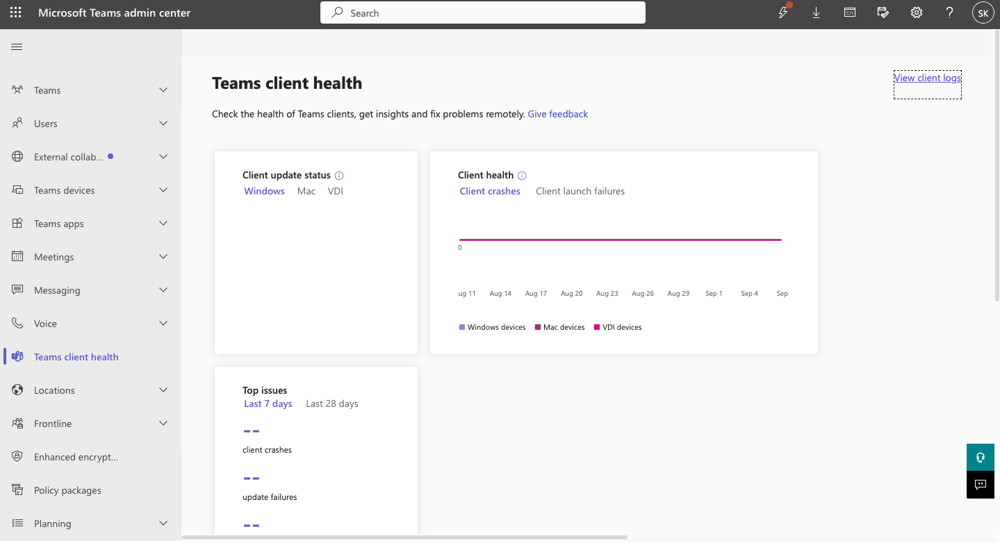
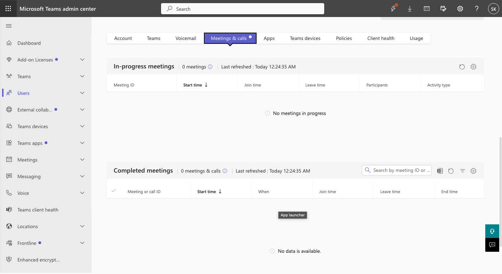
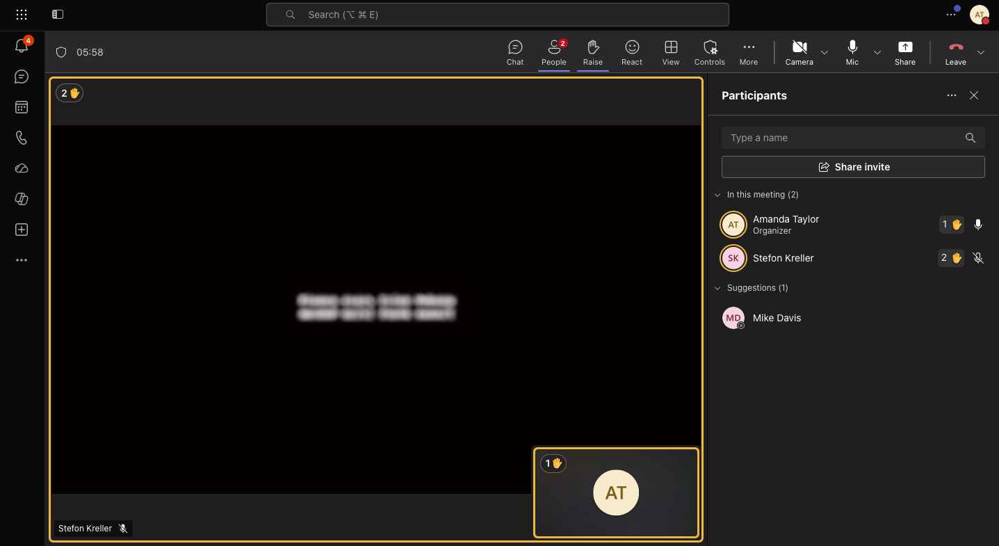
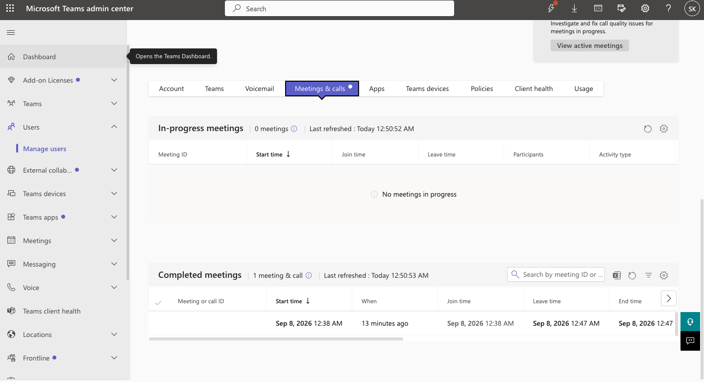
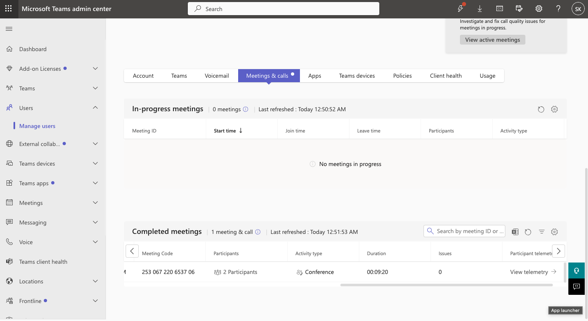
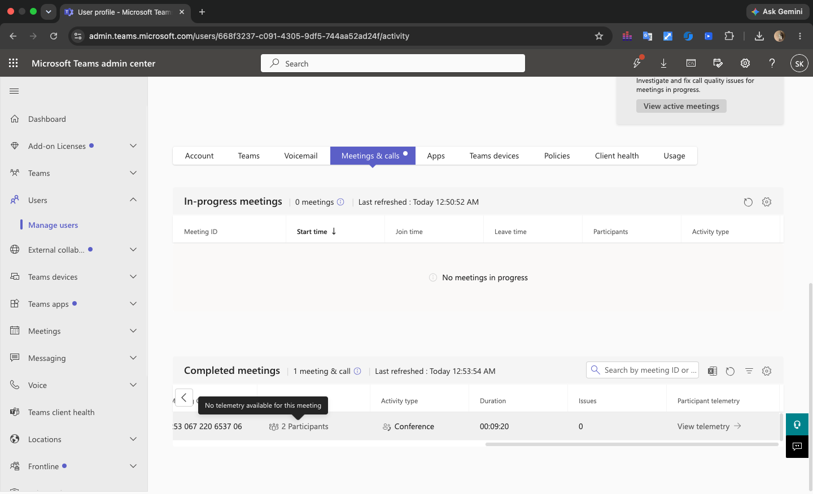
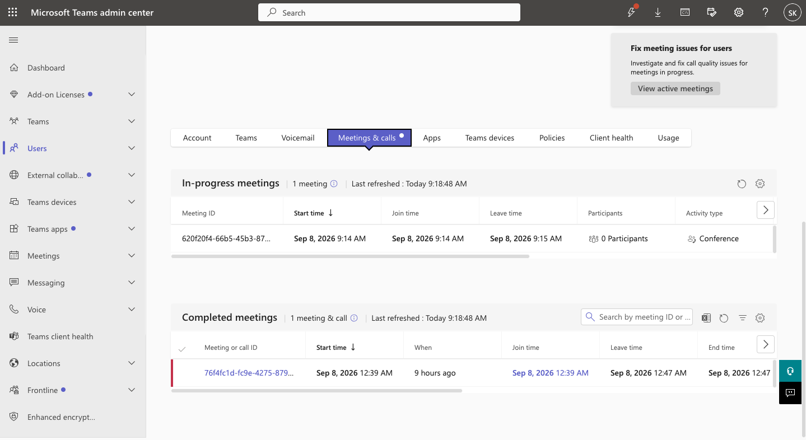
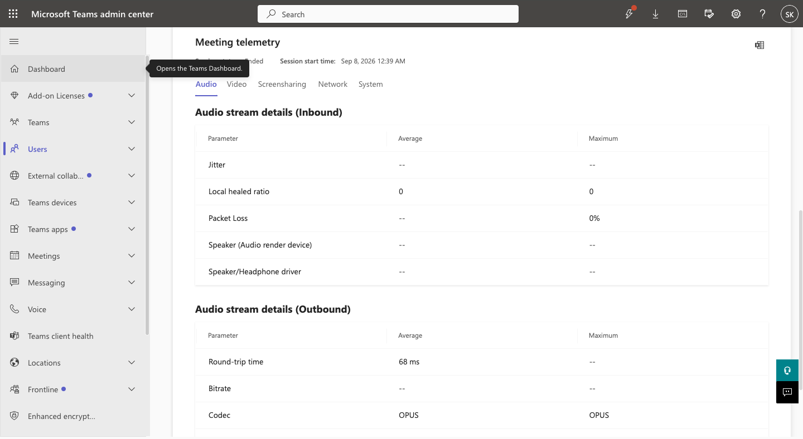
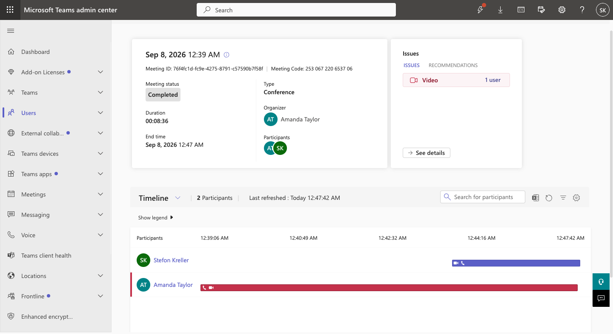
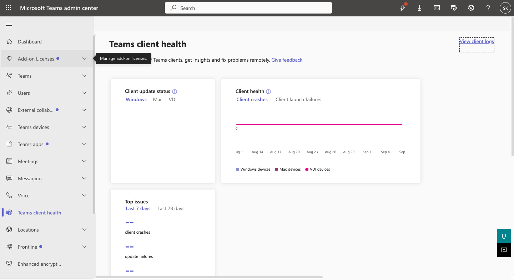

# Microsoft Teams Administration & Support Lab

## 07 — Meeting Troubleshooting

## Overview

This section documents Microsoft Teams meeting troubleshooting using the Teams Admin Center, meeting and call records, 
participant telemetry, client health information, and Call Quality Dashboard data.

A live test meeting was created and completed so that real meeting records and diagnostic data could be reviewed.

Amanda Taylor was used as the primary test user.

---

## Objectives

The objectives of this section were to demonstrate the ability to:

- Create and complete a Microsoft Teams test meeting
- Review completed meeting records in the Teams Admin Center
- Inspect meeting participants
- Review Teams meeting diagnostics
- Review participant telemetry
- Investigate audio and video issues
- Review client health information
- Use Call Quality Dashboard
- Distinguish between policy issues and client/network issues
- Document troubleshooting findings

---

## Test Meeting Setup

A live Microsoft Teams test meeting was created to generate real diagnostic data.

The meeting included:

- Amanda Taylor
- Stefon Kreller

The meeting ran for several minutes before both participants left.

This created a completed meeting record that could later be reviewed through the Microsoft Teams Admin Center.

---

## Meeting Record

The completed meeting appeared under:

```text
Teams Admin Center
    >
Users
    >
Manage users
    >
Amanda Taylor
    >
Meetings & calls
```

The completed meeting record showed:

- Meeting type: Conference
- Participants: 2
- Start and end time
- Meeting duration
- Detected issue count

This demonstrated how Teams administrators can review individual user meeting history when investigating support incidents.

---

## Meeting Diagnostics

The completed meeting record was opened for further investigation.

The Teams Admin Center provided meeting-level diagnostic information.

The meeting summary showed:

```text
Video issue: 1 affected user
```

This indicated that one meeting participant experienced a video-related condition detected by Teams diagnostics.

---

## Participant Telemetry

Participant telemetry was reviewed for the meeting.

The telemetry provided detailed audio information for the participant session.

Captured values included:

```text
Packet loss: 0%
Round-trip time: 68 ms
Audio codec: OPUS
```

These values provided useful evidence for separating network/audio quality issues from video or device problems.

---

## Packet Loss Analysis

The captured audio stream showed:

```text
Packet loss = 0%
```

No packet loss was detected in the available audio telemetry.

This reduced the likelihood that the reported meeting problem was caused by packet loss affecting the audio stream.

---

## Round-Trip Time

The captured network telemetry showed:

```text
Round-trip time = 68 ms
```

This value was documented as part of the investigation.

The purpose of reviewing the metric was not simply to record latency, but to compare the available network evidence with the 
issue Teams detected.

---

## Audio Codec

The meeting used:

```text
OPUS
```

for the captured audio stream.

Reviewing codec information demonstrated the level of meeting telemetry available to Teams administrators during 
troubleshooting.

---

## Video Issue Investigation

Teams identified a video-related issue affecting one participant.

Because the captured audio telemetry showed no packet loss, the investigation focused more heavily on possible video-side 
causes.

Potential follow-up areas included:

- Camera hardware
- Browser camera permissions
- Teams client configuration
- Operating system camera permissions
- Local device performance
- Local network conditions
- Video driver or virtual-camera behavior

The lab did not fabricate a specific camera failure where the diagnostic evidence did not prove one.

Instead, the incident was documented based on the actual Teams evidence.

---

## Client Health Investigation

The Microsoft Teams Client Health area was reviewed as part of the troubleshooting workflow.

This interface can provide visibility into client-side problems such as:

- Teams launch issues
- Update problems
- Client crashes
- General client health conditions

The lab captured the available client health view as part of the meeting investigation.

This demonstrated that meeting troubleshooting should include both meeting telemetry and broader client health review.

---

## Call Quality Dashboard

The Microsoft Call Quality Dashboard was also reviewed.

The administrative path was:

```text
Teams Admin Center
    >
Analytics & reports
    >
Call Quality Dashboard
```

Call Quality Dashboard provided organization-level Teams call and meeting quality information.

The dashboard had populated data available for review.

This allowed the troubleshooting workflow to include both:

- Individual meeting diagnostics
- Organization-level call quality reporting

---

## Troubleshooting Workflow

The meeting troubleshooting workflow used in this lab was:

```text
User Reports Meeting Issue
        |
        v
Open User in Teams Admin Center
        |
        v
Review Meetings & Calls
        |
        v
Open Completed Meeting
        |
        v
Review Detected Issues
        |
        v
Inspect Participant Telemetry
        |
        v
Review Packet Loss / RTT / Codec
        |
        v
Review Client Health
        |
        v
Review Call Quality Dashboard
        |
        v
Document Findings
        |
        v
Determine Appropriate Next Action
```

---

## Difference Between Meeting Policy and Meeting Quality Issues

This lab demonstrated two different categories of Teams meeting support problems.

### Policy-Based Problems

Examples included:

- Meeting scheduling disabled
- Screen sharing disabled
- Recording disabled

These issues were caused by Teams meeting policy configuration.

They were diagnosed through:

- Policy assignment review
- Teams Admin Center
- Microsoft Teams PowerShell

---

### Quality or Client Problems

Examples included:

- Video issue detected during a meeting
- Microphone permission failure
- Client/device problems
- Network-quality concerns

These issues required different diagnostic tools, including:

- Meetings & calls
- Participant telemetry
- Client health
- Call Quality Dashboard
- Browser permissions
- Device settings

Understanding this distinction is important because not every meeting problem is caused by a meeting policy.

---

## Related Troubleshooting Ticket — TEAM-009

[TEAM-009 — Call Quality Investigation](../Help-Desk-Tickets/TEAM-009-Call-Quality-Investigation.md)

During this investigation:

1. A completed meeting was reviewed.
2. The meeting contained two participants.
3. Teams identified a video issue affecting one participant.
4. Participant telemetry was reviewed.
5. Audio packet loss was measured at `0%`.
6. Round-trip time was measured at `68 ms`.
7. The audio codec was `OPUS`.
8. Client Health was reviewed.
9. Call Quality Dashboard was reviewed.
10. The investigation was documented without inventing a root cause not proven by the evidence.

The final status was:

```text
INVESTIGATION COMPLETED
```

---

## Screenshots

### Teams Client Health Baseline



Documents the Teams Client Health administrative interface.

---

### Amanda Taylor Meetings and Calls Baseline



Shows the user-level meeting and call troubleshooting interface before the test meeting was generated.

---

### Teams Test Meeting



Documents the live test meeting used to generate diagnostic information.

---

### Completed Meeting Record



Shows the completed Teams meeting available in the Admin Center for troubleshooting.

---

### Completed Meeting Summary



Documents the meeting-level troubleshooting summary.

---

### Telemetry Availability Review



Documents the initial telemetry state observed during the lab before additional data later populated.

---

## Troubleshooting Evidence

Additional troubleshooting evidence was captured in the dedicated troubleshooting folder.

### Video Issue Identified



Shows the Teams meeting diagnostic identifying one affected user with a video issue.

---

### Audio Telemetry Investigation



Documents the available audio telemetry, including packet loss, round-trip time, and codec.

---

### Client Health Investigation



Shows the Teams Client Health review performed as part of the investigation.

---

### Call Quality Dashboard Investigation



Documents the Call Quality Dashboard review.

---

### Investigation Summary


Summarizes the final findings and next recommended troubleshooting actions.

---

## Key Findings

The investigation established the following:

```text
Meeting participants: 2
Detected issue: Video
Affected users: 1
Audio packet loss: 0%
Round-trip time: 68 ms
Audio codec: OPUS
Participant telemetry reviewed: Yes
Client health reviewed: Yes
Call Quality Dashboard reviewed: Yes
```

The available evidence did not support claiming a Teams service outage or an audio packet-loss problem.

The most appropriate next action, if the video issue recurred, would be to continue investigating the affected user's 
camera, permissions, client, device, and local network environment.

---

## Skills Demonstrated

- Microsoft Teams meeting troubleshooting
- Teams Admin Center
- Meetings and calls diagnostics
- Participant telemetry
- Audio quality analysis
- Video issue investigation
- Packet loss analysis
- Round-trip latency review
- Audio codec review
- Teams Client Health
- Call Quality Dashboard
- Evidence-based troubleshooting
- Root-cause isolation
- Technical documentation

---

## Result

A live Microsoft Teams meeting was successfully generated and investigated through Microsoft Teams administrative tools.

The completed meeting produced real diagnostic evidence.

The troubleshooting process identified a video-related issue affecting one participant while audio telemetry showed:

- `0%` packet loss
- `68 ms` round-trip time
- `OPUS` audio codec

The investigation demonstrated how Teams administrators can combine user meeting history, participant telemetry, Client 
Health, and Call Quality Dashboard data to investigate meeting-quality incidents without assuming a root cause that is not 
supported by the available evidence.
