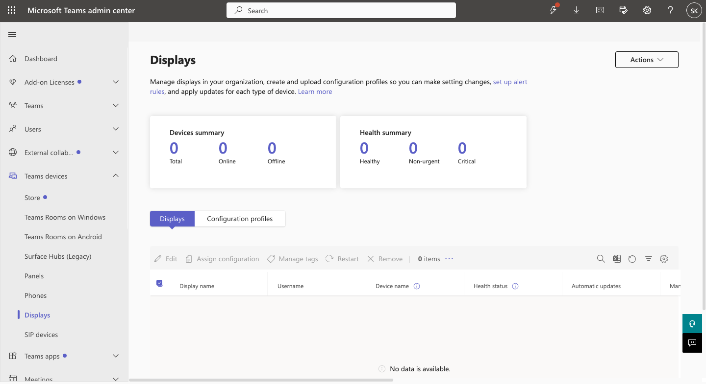
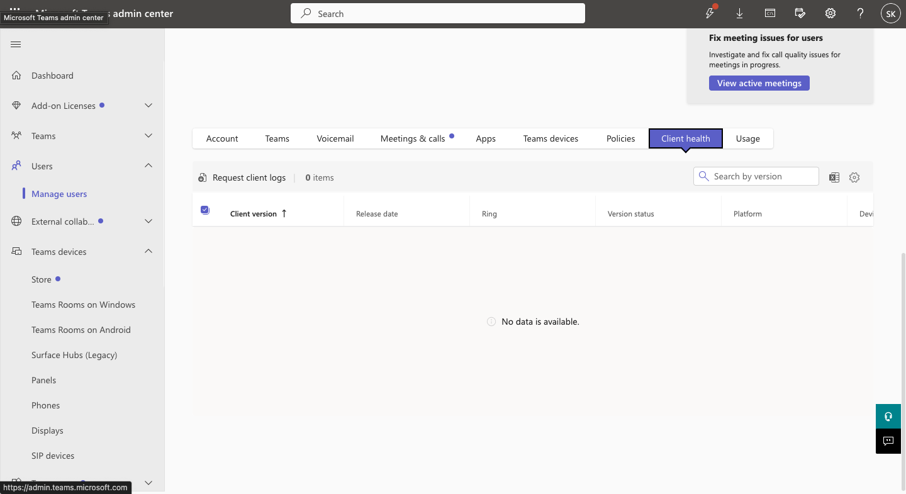
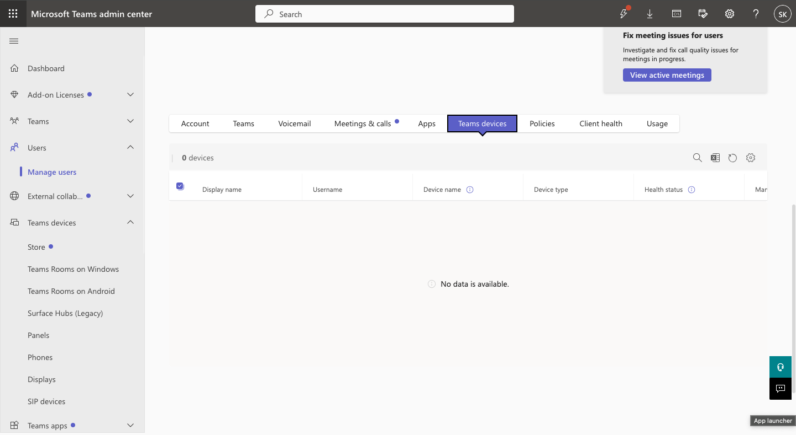
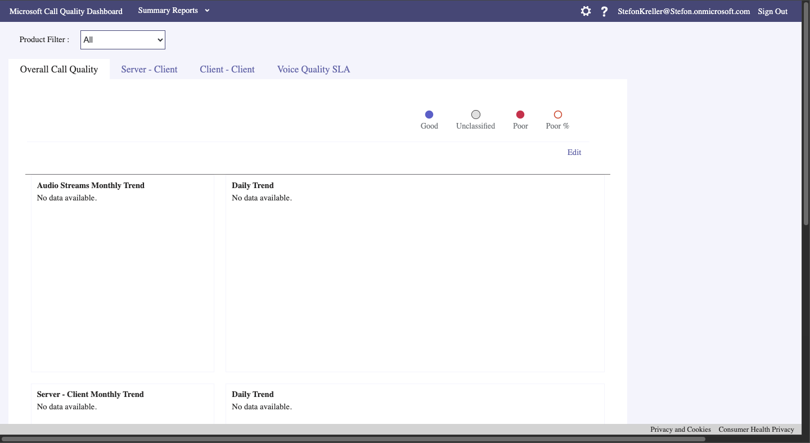
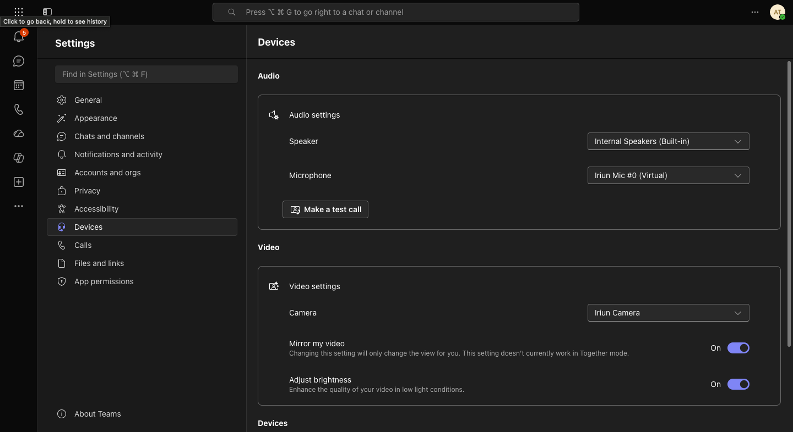
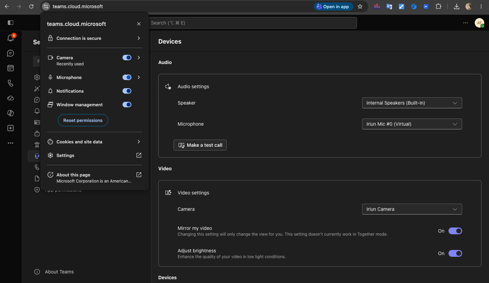
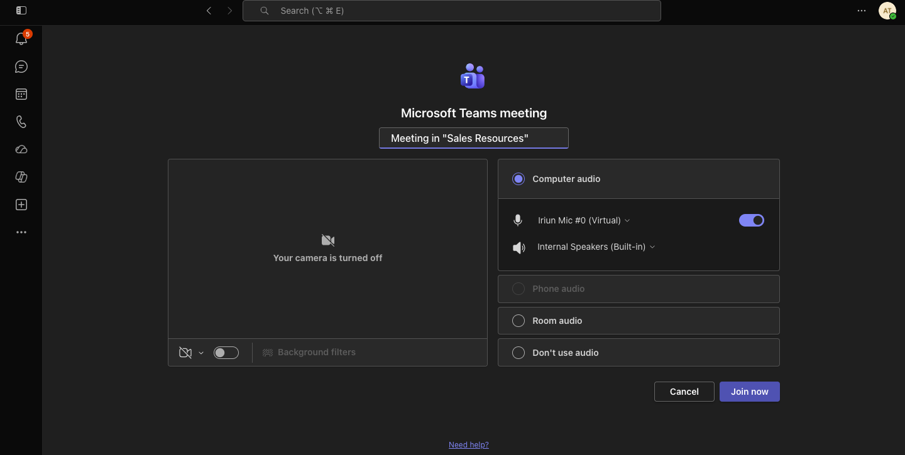

# Microsoft Teams Administration & Support Lab

## 08 — Calling & Device Troubleshooting

## Overview

This section documents Microsoft Teams calling and device troubleshooting, including Teams device administration, user 
device review, browser permission troubleshooting, client-side microphone remediation, and Call Quality Dashboard analysis.

The lab focused on distinguishing between:

- Tenant configuration issues
- Teams policy issues
- User device issues
- Browser permission problems
- Meeting-quality problems
- Client health conditions

Amanda Taylor was used as the primary end-user test account.

---

## Objectives

The objectives of this section were to demonstrate the ability to:

- Review Teams device administration
- Review user-level Teams device information
- Review Teams Client Health
- Investigate microphone and camera problems
- Reproduce a browser permission failure
- Restore microphone access
- Verify device recovery
- Review call and meeting quality information
- Use Call Quality Dashboard
- Document realistic end-user troubleshooting

---

## Teams Device Administration

The Microsoft Teams Admin Center was used to review the available Teams device management interface.

The administrative area provided access to Teams-supported device categories and managed device information.

This demonstrated that Teams administrators can review hardware-related resources in addition to users, Teams, policies, and 
meetings.

---

## User Device Review

Amanda Taylor's account was reviewed through:

```text
Teams Admin Center
    >
Users
    >
Manage users
    >
Amanda Taylor
```

The following user-level support areas were reviewed:

- Client health
- Teams devices
- Meetings and calls

This created a broader troubleshooting workflow that did not assume every Teams issue was caused by a policy.

---

## Client Health

The Teams Client Health interface was reviewed for Amanda Taylor and at the tenant level.

Client Health can help identify issues involving:

- Teams client startup
- Update failures
- Application crashes
- Client reliability
- User-specific client problems

The available client health information was documented as part of the support process.

---

## Teams Devices

Amanda Taylor's Teams device page was reviewed.

No managed Teams device inventory was available for the user at that time.

This was still useful administrative evidence because it demonstrated that the appropriate device-management location was 
checked during troubleshooting.

A lack of registered managed Teams hardware does not prevent a user from using microphones, cameras, speakers, or 
browser-based Teams clients.

---

## Device Baseline

Before reproducing the microphone issue, Teams successfully detected the user's configured devices.

The baseline included:

- Internal speakers
- Iriun microphone
- Iriun camera
- Teams test-call functionality

This confirmed that the microphone and other devices were functioning before the failure was introduced.

---

## Simulated Microphone Issue

A realistic client-side Teams problem was reproduced by changing browser site permissions.

In Google Chrome, microphone permission for the Microsoft Teams site was changed to:

```text
Block
```

The camera permission remained available so the issue could be isolated specifically to microphone access.

---

## User-Facing Symptoms

After microphone permission was blocked, Microsoft Teams could no longer access the device normally.

The Teams client displayed a warning indicating that audio or video permissions needed to be allowed through the browser.

The affected state demonstrated symptoms similar to a common help desk report:

```text
"My microphone is not working in Teams."
```

This issue occurred even though:

- The Microsoft Teams tenant was functioning
- The user account was valid
- Teams policies were not blocking microphone use
- The physical or virtual microphone was still installed

---

## Root Cause

The root cause was:

```text
Browser microphone permission blocked for Microsoft Teams
```

This is an example of a client-side issue that would not be resolved by changing Teams meeting policies or tenant-wide 
settings.

---

## Resolution

Browser microphone permission was changed from:

```text
Block
```

to:

```text
Allow
```

The Teams client was refreshed.

After the permission change, Teams detected the microphone again.

---

## Resolution Verification

The Teams device settings were reviewed after remediation.

The restored environment showed the configured:

- Speaker
- Microphone
- Camera

Teams test-call functionality was also available.

This verified that microphone access had been restored at the client level.

---

## Device Troubleshooting Workflow

The workflow used in this section was:

```text
User Reports Microphone Problem
        |
        v
Review Teams Device Settings
        |
        v
Confirm Baseline Device Detection
        |
        v
Review Browser Permissions
        |
        v
Identify Microphone Permission Block
        |
        v
Reproduce User-Facing Teams Error
        |
        v
Restore Browser Permission
        |
        v
Reload Teams
        |
        v
Verify Microphone Detection
        |
        v
Confirm Resolution
```

---

## Why Device Troubleshooting Matters

Microsoft Teams support requires troubleshooting beyond tenant configuration.

A microphone or camera problem may originate from:

- Browser permissions
- Operating system permissions
- Device drivers
- Physical device failure
- Wrong Teams device selection
- Virtual audio or camera software
- Local client problems
- Network instability
- Meeting policy restrictions

A good support workflow isolates these layers instead of immediately changing Microsoft 365 settings.

---

## Call Quality Dashboard

The Microsoft Call Quality Dashboard was reviewed through:

```text
Teams Admin Center
    >
Analytics & reports
    >
Call Quality Dashboard
```

The dashboard provided tenant-level call and meeting quality information.

During the lab, CQD later populated data related to the test Teams meeting.

This allowed the project to demonstrate both:

- Local device troubleshooting
- Administrative call-quality analysis

---

## Relationship to Meeting Diagnostics

Device troubleshooting and meeting diagnostics were treated as connected but separate support areas.

### Device Troubleshooting

Used for issues such as:

- Microphone unavailable
- Camera unavailable
- Wrong speaker
- Browser permissions
- Device selection

### Meeting Diagnostics

Used for issues such as:

- Packet loss
- Round-trip latency
- Video quality
- Participant telemetry
- Call Quality Dashboard findings

This distinction helps avoid applying the wrong troubleshooting method to the wrong problem.

---

## Related Troubleshooting Ticket — TEAM-008

[TEAM-008 — Microphone Permission Issue](../Help-Desk-Tickets/TEAM-008-Microphone-Permission-Issue.md)

During this incident:

1. Teams initially detected the audio and video devices.
2. Browser microphone permission was blocked.
3. Teams reproduced the user-facing microphone problem.
4. Browser permissions were inspected.
5. Microphone access was restored.
6. Teams detected the microphone again.
7. Device access was verified.
8. The ticket was resolved.

---

## Related Troubleshooting Ticket — TEAM-009

[TEAM-009 — Call Quality Investigation](../Help-Desk-Tickets/TEAM-009-Call-Quality-Investigation.md)

This investigation used:

- Completed Teams meeting records
- Participant telemetry
- Teams Client Health
- Call Quality Dashboard
- Video issue diagnostics
- Audio quality metrics

This demonstrated how device troubleshooting can escalate into deeper Teams meeting diagnostics when necessary.

---

## Screenshots

### Teams Devices Baseline



Documents the Teams device administration area.

---

### Amanda Taylor Client Health



Shows the user-level Teams Client Health review.

---

### Amanda Taylor Teams Devices



Documents the user-level Teams device inventory check.

---

### Call Quality Dashboard Baseline



Shows the Microsoft Teams Call Quality Dashboard interface.

---

## Troubleshooting Evidence

### Device Baseline



Shows the Teams client detecting the configured speaker, microphone, and camera before the issue.

---

### Microphone Permission Blocked


Documents the browser permission responsible for the microphone failure.

---

### Microphone Issue Reproduced


Shows the Teams user-facing device permission problem.

---

### Microphone Permission Restored



Documents the corrected browser microphone permission.

---

### Resolution Verified



Shows the restored Teams device configuration after remediation.

---

## Skills Demonstrated

- Microsoft Teams device troubleshooting
- Teams Admin Center
- Teams Client Health
- Teams device administration
- Browser permission troubleshooting
- Microphone troubleshooting
- Camera and audio device review
- Microsoft Teams web client
- Call Quality Dashboard
- Root-cause isolation
- Client-side troubleshooting
- User support
- Technical documentation

---

## Result

The lab successfully demonstrated a realistic Microsoft Teams microphone support incident.

The Teams environment and user account were healthy, but the microphone failed because browser permission had been blocked.

The issue was reproduced, diagnosed, corrected, and verified without making unnecessary changes to Microsoft Teams tenant 
configuration.

The section also documented Teams device administration, Client Health, and Call Quality Dashboard usage, providing a 
broader foundation for troubleshooting Teams calling, meeting, audio, video, and client-side problems.
