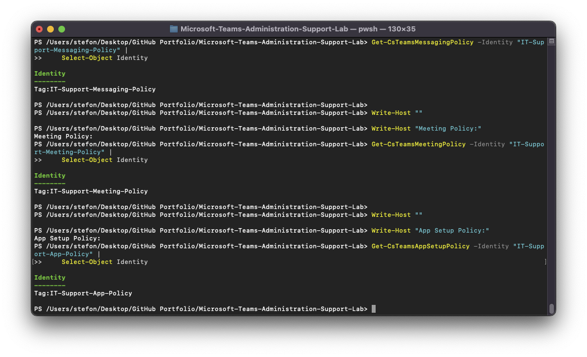
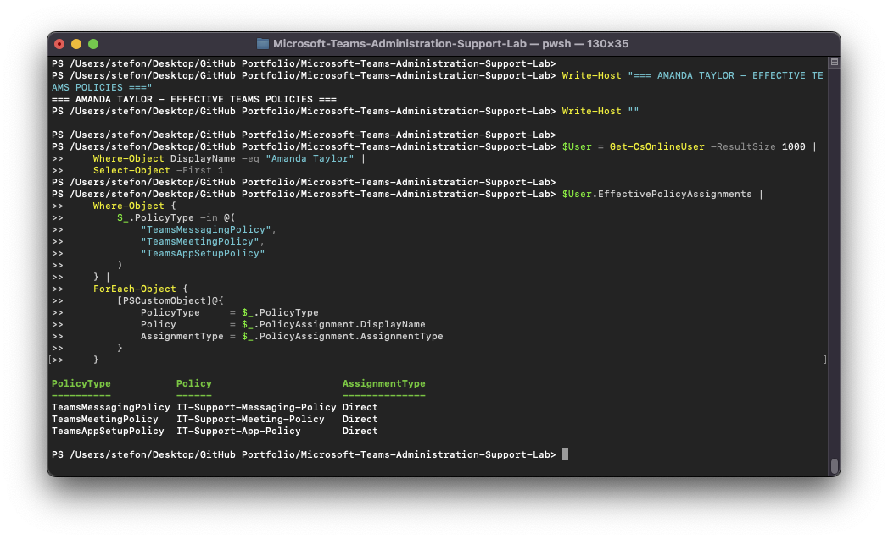
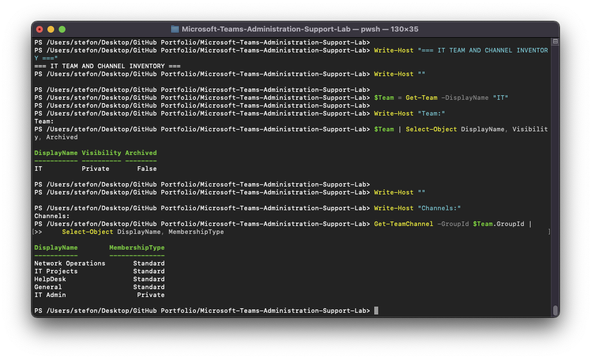
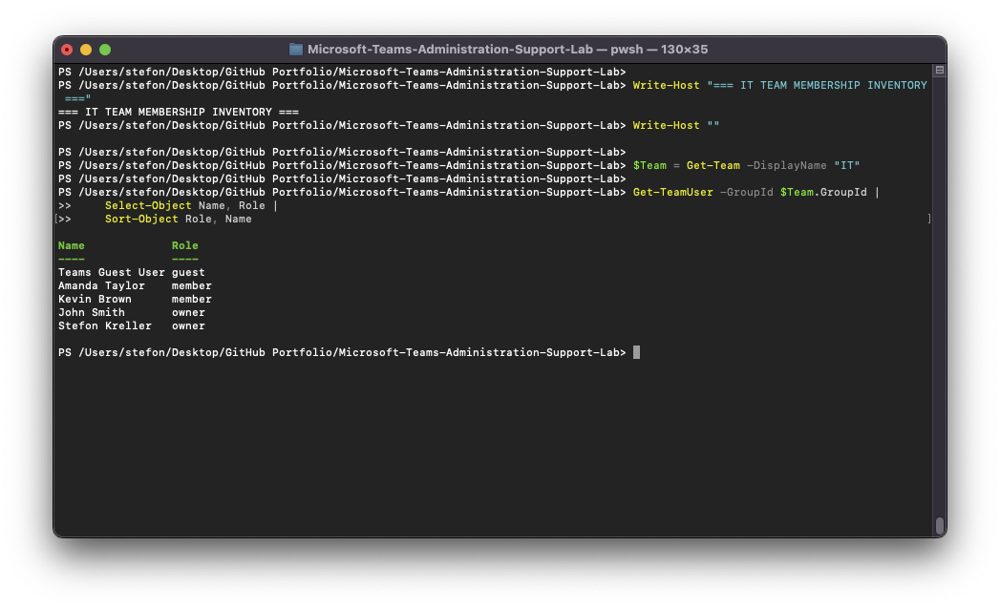

# Microsoft Teams Administration & Support Lab

## 09 — Microsoft Teams PowerShell

## Overview

This section documents the Microsoft Teams PowerShell administration performed throughout the lab.

PowerShell was used alongside the Microsoft Teams Admin Center to provide command-line verification of tenant connectivity, 
users, Teams, channels, memberships, guest access, external federation, messaging policies, meeting policies, app setup 
policies, and troubleshooting resolutions.

The environment used:

```text
PowerShell 7.6.3
MicrosoftTeams 7.9.0
macOS
```

---

## Objectives

The objectives of this section were to demonstrate the ability to:

- Connect to Microsoft Teams through PowerShell
- Query tenant information
- Inventory Teams users
- Inventory Microsoft Teams
- Review Team channels
- Review Team membership
- Verify owners, members, and guests
- Inspect messaging policies
- Inspect meeting policies
- Inspect app setup policies
- Review effective user policy assignments
- Validate guest access
- Validate external federation
- Use PowerShell during troubleshooting
- Verify remediation after configuration changes

---

## PowerShell Environment

The Microsoft Teams PowerShell environment was verified before administration began.

PowerShell version:

```text
7.6.3
```

MicrosoftTeams module version:

```text
7.9.0
```

The installed module was reviewed with:

```powershell
Get-Module MicrosoftTeams -ListAvailable |
    Sort-Object Version -Descending |
    Select-Object -First 1 Name, Version
```

---

## Connecting to Microsoft Teams

The original Teams PowerShell connection attempt encountered a Web Account Manager compatibility issue in the macOS 
PowerShell environment.

The successful connection used:

```powershell
Connect-MicrosoftTeams -DisableWAM
```

After authentication, tenant information was queried to verify connectivity.

Example:

```powershell
$Tenant = Get-CsTenant

[PSCustomObject]@{
    Connection = "Successful"
    Tenant     = $Tenant.DisplayName
    Module     = "MicrosoftTeams $((Get-Module MicrosoftTeams).Version)"
}
```

The successful tenant query confirmed that the PowerShell session was authenticated and able to communicate with Microsoft 
Teams.

---

## Teams User Inventory

Microsoft Teams users were inventoried with:

```powershell
$Users = Get-CsOnlineUser -ResultSize 1000
```

The initial environment baseline contained:

```text
34 Teams users
```

After creation of the guest identity, the later administrative summary contained:

```text
35 Teams users
```

A representative sample of users was reviewed with:

```powershell
$Users |
    Where-Object DisplayName |
    Sort-Object DisplayName |
    Select-Object -First 8 DisplayName
```

This demonstrated command-line discovery of Teams-enabled identities.

---

## Teams Inventory

Existing Teams were queried using:

```powershell
$Teams = Get-Team
```

The tenant contained:

```text
8 Teams
```

The Team inventory could be reviewed with:

```powershell
$Teams |
    Sort-Object DisplayName |
    Select-Object DisplayName, Visibility, Archived
```

This provided a command-line baseline before Team administration and troubleshooting.

---

## IT Team Administration

The IT Team was used throughout the lab as the primary administrative Team.

It was retrieved with:

```powershell
$Team = Get-Team -DisplayName "IT"
```

The Team configuration was reviewed with:

```powershell
$Team |
    Select-Object DisplayName, Visibility, Archived
```

The resulting configuration confirmed:

```text
DisplayName: IT
Visibility: Private
Archived: False
```

---

## Channel Inventory

The IT Team channels were queried with:

```powershell
Get-TeamChannel -GroupId $Team.GroupId |
    Select-Object DisplayName, MembershipType
```

The final channel inventory included:

```text
Network Operations    Standard
IT Projects           Standard
HelpDesk              Standard
General               Standard
IT Admin              Private
```

This demonstrated PowerShell visibility into both standard and private channels.

---

## Team Membership Inventory

Team membership was queried with:

```powershell
Get-TeamUser -GroupId $Team.GroupId |
    Select-Object Name, Role |
    Sort-Object Role, Name
```

The output demonstrated multiple role types, including:

- Owners
- Members
- Guest user

The membership inventory was also used during troubleshooting to confirm whether Amanda Taylor or the Teams Guest User had 
the expected Team access.

---

## Guest User Verification

Guest membership was verified with:

```powershell
Get-TeamUser -GroupId $Team.GroupId |
    Where-Object Name -eq "Teams Guest User" |
    Select-Object Name, Role
```

Tenant guest configuration was inspected with:

```powershell
Get-CsTeamsClientConfiguration |
    Select-Object AllowGuestUser
```

The working configuration returned:

```text
AllowGuestUser = True
```

This command later became important during guest-access troubleshooting.

---

## External Federation Verification

External Teams communication was reviewed with:

```powershell
Get-CsTenantFederationConfiguration |
    Select-Object AllowFederatedUsers, AllowTeamsConsumer
```

This allowed PowerShell to verify whether Teams federation with external organizations was enabled.

During troubleshooting, this command demonstrated the difference between:

```text
AllowFederatedUsers = False
```

and the restored state:

```text
AllowFederatedUsers = True
```

---

## Messaging Policy Administration

The custom messaging policy created during the lab was:

```text
IT-Support-Messaging-Policy
```

The policy was queried with:

```powershell
Get-CsTeamsMessagingPolicy -Identity "IT-Support-Messaging-Policy"
```

Selected settings were reviewed with:

```powershell
Get-CsTeamsMessagingPolicy -Identity "IT-Support-Messaging-Policy" |
    Select-Object Identity,
                  AllowUserChat,
                  AllowUserDeleteMessage,
                  AllowUserEditMessage,
                  ReadReceiptsEnabledType
```

This command was later used to diagnose the message-editing incident.

---

## Meeting Policy Administration

The custom meeting policy was:

```text
IT-Support-Meeting-Policy
```

It was queried with:

```powershell
Get-CsTeamsMeetingPolicy -Identity "IT-Support-Meeting-Policy"
```

Important meeting settings were reviewed with:

```powershell
Get-CsTeamsMeetingPolicy -Identity "IT-Support-Meeting-Policy" |
    Select-Object Identity,
                  ScreenSharingMode,
                  AllowCloudRecording,
                  AllowTranscription,
                  AllowMeetNow,
                  AllowPrivateMeetingScheduling
```

This allowed multiple Teams meeting issues to be diagnosed through PowerShell.

---

## App Setup Policy Administration

The custom app setup policy was:

```text
IT-Support-App-Policy
```

It was queried with:

```powershell
Get-CsTeamsAppSetupPolicy -Identity "IT-Support-App-Policy"
```

Selected policy information was reviewed with:

```powershell
Get-CsTeamsAppSetupPolicy -Identity "IT-Support-App-Policy" |
    Select-Object Identity, AllowUserPinning
```

---

## Effective User Policy Assignments

Amanda Taylor was the primary test user for custom Teams policies.

She was located with:

```powershell
$User = Get-CsOnlineUser -ResultSize 1000 |
    Where-Object DisplayName -eq "Amanda Taylor" |
    Select-Object -First 1
```

Effective policy assignments were then inspected with:

```powershell
$User.EffectivePolicyAssignments |
    Where-Object {
        $_.PolicyType -in @(
            "TeamsMessagingPolicy",
            "TeamsMeetingPolicy",
            "TeamsAppSetupPolicy"
        )
    } |
    ForEach-Object {
        [PSCustomObject]@{
            PolicyType     = $_.PolicyType
            Policy         = $_.PolicyAssignment.DisplayName
            AssignmentType = $_.PolicyAssignment.AssignmentType
        }
    }
```

The output confirmed direct assignment of:

```text
IT-Support-Messaging-Policy
IT-Support-Meeting-Policy
IT-Support-App-Policy
```

to Amanda Taylor.

The assignment type was:

```text
Direct
```

---

## Get-CsUserPolicyAssignment

App policy troubleshooting also used:

```powershell
Get-CsUserPolicyAssignment
```

Example:

```powershell
Get-CsUserPolicyAssignment `
    -Identity $User.UserPrincipalName `
    -PolicyType TeamsAppSetupPolicy
```

This was useful when determining whether Amanda Taylor had a direct app setup policy or had fallen back to the Global 
organization-wide policy.

---

## Custom Policy Inventory

The three custom policies created during the lab were verified together.

```powershell
Write-Host "Messaging Policy:"
Get-CsTeamsMessagingPolicy -Identity "IT-Support-Messaging-Policy" |
    Select-Object Identity

Write-Host ""

Write-Host "Meeting Policy:"
Get-CsTeamsMeetingPolicy -Identity "IT-Support-Meeting-Policy" |
    Select-Object Identity

Write-Host ""

Write-Host "App Setup Policy:"
Get-CsTeamsAppSetupPolicy -Identity "IT-Support-App-Policy" |
    Select-Object Identity
```

This produced a concise inventory of the policies used throughout the project.

---

## Administrative Summary

A final PowerShell summary was generated using:

```powershell
$Teams = Get-Team
$Users = Get-CsOnlineUser -ResultSize 1000

[PSCustomObject]@{
    Teams              = $Teams.Count
    TeamsUsers         = $Users.Count
    MessagingPolicy    = "IT-Support-Messaging-Policy"
    MeetingPolicy      = "IT-Support-Meeting-Policy"
    AppSetupPolicy     = "IT-Support-App-Policy"
    GuestAccessEnabled = (Get-CsTeamsClientConfiguration).AllowGuestUser
}
```

The final administrative summary confirmed:

```text
Teams: 8
Teams Users: 35
Messaging Policy: IT-Support-Messaging-Policy
Meeting Policy: IT-Support-Meeting-Policy
App Setup Policy: IT-Support-App-Policy
Guest Access Enabled: True
```

---

## PowerShell in Troubleshooting

PowerShell was not used only for inventory.

It was also used throughout the troubleshooting tickets to prove:

```text
Problem State
    >
Root Cause
    >
Configuration Change
    >
Post-Remediation State
```

Examples included:

### TEAM-001

Verified that Amanda Taylor was missing from Team membership and later confirmed her restored `member` role.

### TEAM-002

Verified:

```text
AllowPrivateMeetingScheduling
True -> False -> True
```

### TEAM-003

Verified:

```text
AllowGuestUser
True -> False -> True
```

### TEAM-004

Verified:

```text
AllowFederatedUsers
True -> False -> True
```

### TEAM-005

Verified:

```text
ScreenSharingMode
EntireScreen -> Disabled -> EntireScreen
```

### TEAM-006

Verified:

```text
AllowCloudRecording
False -> True
```

### TEAM-007

Verified the removal and restoration of:

```text
IT-Support-App-Policy
```

### TEAM-010

Verified:

```text
AllowUserEditMessage
True -> False -> True
```

These checks provided stronger evidence than relying only on graphical configuration screenshots.

---

## PowerShell Administration Workflow

The general command-line workflow used throughout the lab was:

```text
Connect-MicrosoftTeams
        |
        v
Query Tenant
        |
        v
Inventory Users and Teams
        |
        v
Review Teams / Channels / Membership
        |
        v
Review Custom Policies
        |
        v
Inspect Effective User Assignments
        |
        v
Reproduce Support Issue
        |
        v
Query Affected Configuration
        |
        v
Correct Configuration
        |
        v
Query Again
        |
        v
Verify Resolution
```

---

## Screenshots

### Custom Teams Policy Inventory



Shows the three custom Microsoft Teams policies used in the lab.

---

### Amanda Taylor Effective Policies



Shows the direct effective messaging, meeting, and app setup policy assignments.

---

### IT Team Channel Inventory



Documents the IT Team and channel configuration from PowerShell.

---

### IT Team Membership Inventory



Shows Team owners, members, and guest membership from the command line.

---

### Teams Administration Summary


Summarizes the final Teams user count, Team count, custom policies, and guest access state.

---

## Skills Demonstrated

- Microsoft Teams PowerShell
- PowerShell 7
- MicrosoftTeams module
- Connect-MicrosoftTeams
- Get-CsTenant
- Get-CsOnlineUser
- Get-Team
- Get-TeamChannel
- Get-TeamUser
- Get-CsTeamsMessagingPolicy
- Get-CsTeamsMeetingPolicy
- Get-CsTeamsAppSetupPolicy
- Get-CsUserPolicyAssignment
- Get-CsTeamsClientConfiguration
- Get-CsTenantFederationConfiguration
- Effective policy analysis
- Team membership verification
- Guest access verification
- External federation troubleshooting
- Policy troubleshooting
- Post-remediation verification
- Cross-platform Microsoft 365 administration
- Technical documentation

---

## Result

Microsoft Teams PowerShell was successfully integrated throughout the lab as both an administrative and troubleshooting 
tool.

The final environment contained:

- 8 Microsoft Teams
- 35 Teams users
- Custom messaging policy
- Custom meeting policy
- Custom app setup policy
- Guest access enabled
- Standard and private channels
- Owners, members, and guest membership

PowerShell was used to independently verify configuration changes made through the Teams Admin Center and to prove both 
failure and restored states during troubleshooting.

This provided command-line evidence of Microsoft Teams administration rather than relying solely on graphical portal 
configuration.
