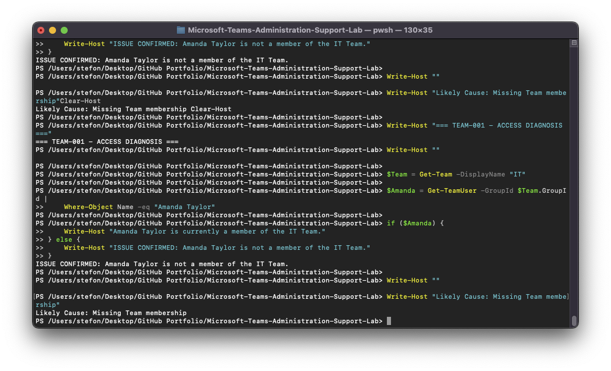
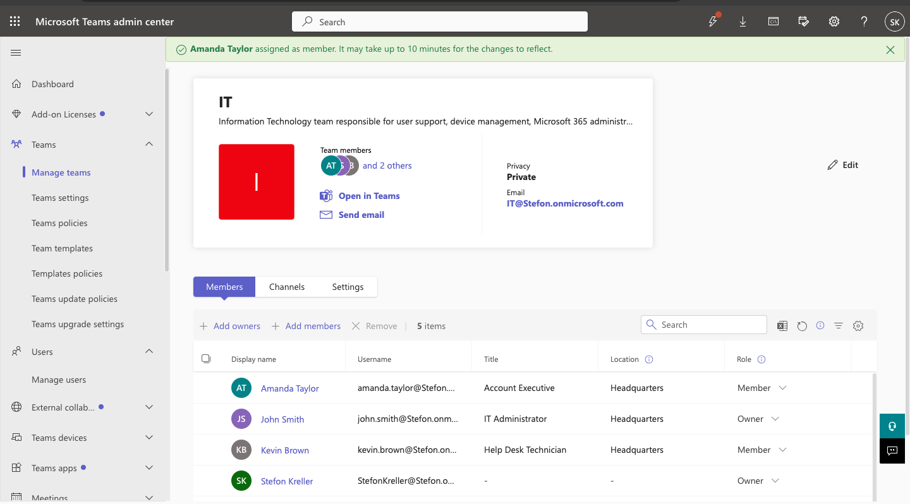

# TEAM-001 — User Missing Access to Microsoft Teams Team

## Ticket Summary

| Field | Details |
|---|---|
| Ticket ID | TEAM-001 |
| User | Amanda Taylor |
| Service | Microsoft Teams |
| Category | Team Membership / Access |
| Priority | Medium |
| Status | Resolved |

## Issue

Amanda Taylor reported that she could no longer access the IT Team in Microsoft Teams.

The IT Team itself remained active and available to other users, indicating that the issue was isolated to Amanda's membership rather than a Team-wide outage.

## Investigation

Microsoft Teams PowerShell was used to review the IT Team membership.

The investigation confirmed that Amanda Taylor was not listed as a member of the IT Team.

This isolated the issue to Team membership rather than licensing, tenant availability, or a Teams service failure.

## Root Cause

Amanda Taylor had been removed from the IT Team.

## Resolution

Amanda Taylor was added back to the IT Team as a standard member.

The Team membership was then queried again through Microsoft Teams PowerShell.

## Verification

Post-remediation verification confirmed:

- Amanda Taylor appeared in the IT Team membership.
- Her role was `member`.
- Team access was restored.
- Ticket status was set to resolved.

## Evidence

### Membership Issue Diagnosed

### Access Restored

### Resolution Verified

## Support Skills Demonstrated

- Microsoft Teams membership administration
- Team owner/member role management
- Microsoft Teams PowerShell
- Access troubleshooting
- Root-cause analysis
- Post-remediation validation
