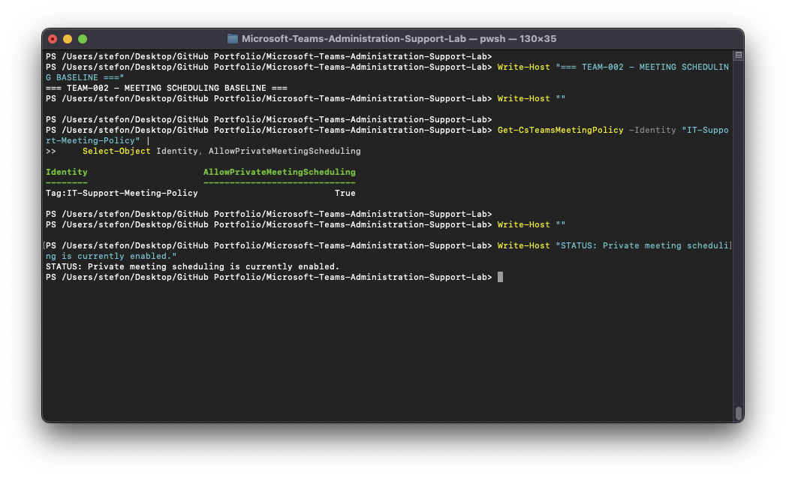
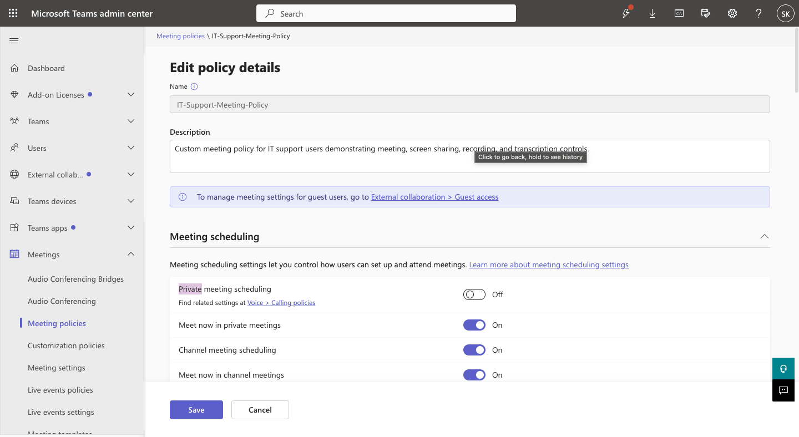
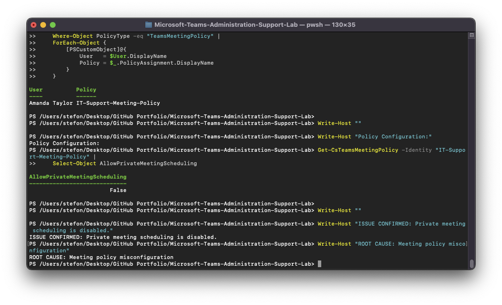
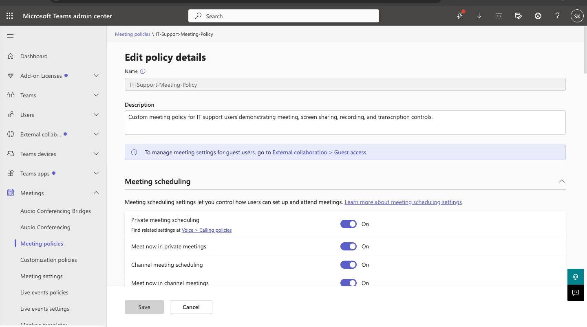

# TEAM-002 — User Cannot Schedule Private Teams Meetings

## Ticket Summary

| Field | Details |
|---|---|
| Ticket ID | TEAM-002 |
| User | Amanda Taylor |
| Service | Microsoft Teams |
| Category | Meeting Policy |
| Priority | Medium |
| Status | Resolved |

## Issue

Amanda Taylor was unable to schedule private Microsoft Teams meetings.

## Investigation

The assigned `IT-Support-Meeting-Policy` was reviewed using Microsoft Teams PowerShell.

The baseline configuration showed private meeting scheduling enabled.

The issue was reproduced by disabling the private meeting scheduling setting in the custom meeting policy.

PowerShell verification then confirmed:

`AllowPrivateMeetingScheduling = False`

Amanda Taylor was also confirmed to be using the affected custom meeting policy.

## Root Cause

Private meeting scheduling had been disabled in the assigned Teams meeting policy.

## Resolution

Private meeting scheduling was re-enabled in the `IT-Support-Meeting-Policy`.

## Verification

PowerShell verification confirmed:

- User: Amanda Taylor
- Meeting policy: `IT-Support-Meeting-Policy`
- Private meeting scheduling: `True`
- Status: Resolved

## Evidence

## Support Skills Demonstrated

- Teams meeting policy administration
- Policy assignment troubleshooting
- Microsoft Teams PowerShell
- Configuration comparison
- Service restoration
