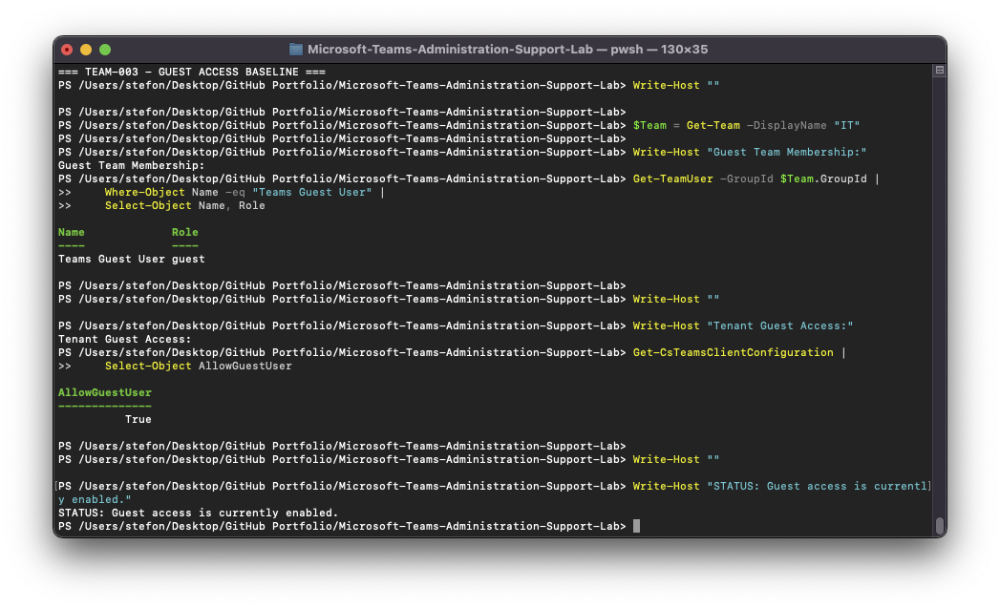
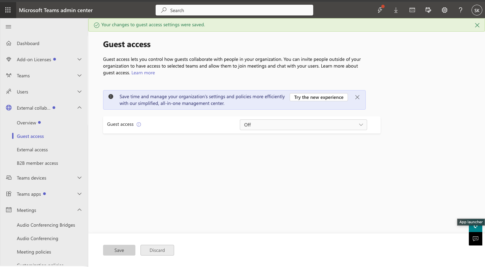
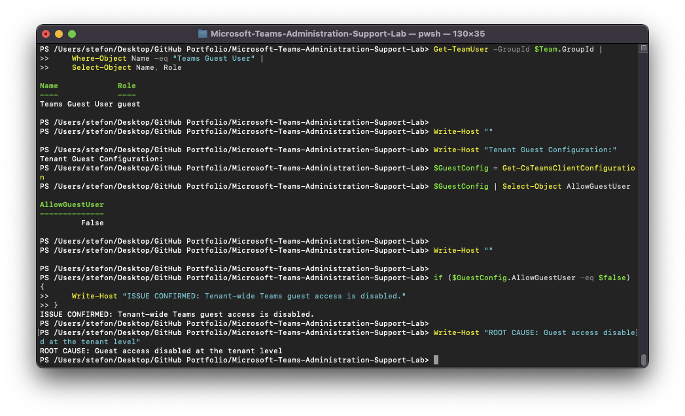
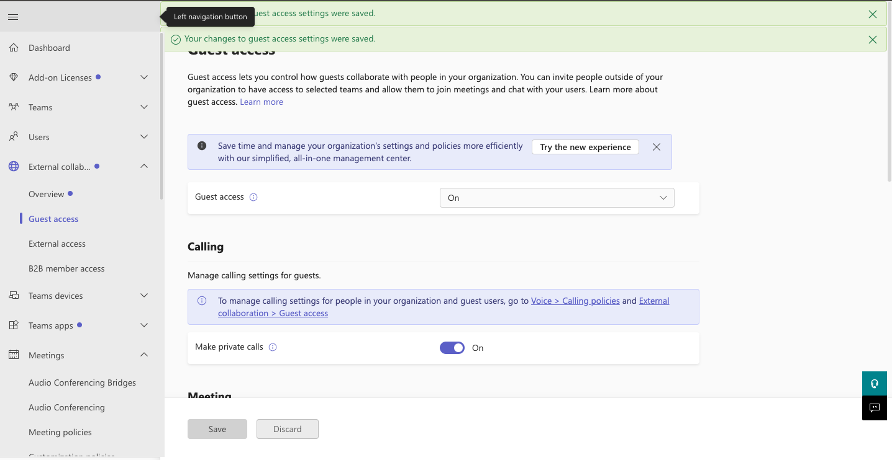

# TEAM-003 — Guest User Cannot Access Microsoft Teams

## Ticket Summary

| Field | Details |
|---|---|
| Ticket ID | TEAM-003 |
| Service | Microsoft Teams |
| Category | Guest Access |
| Priority | Medium |
| Status | Resolved |

## Issue

A guest user could no longer collaborate through Microsoft Teams even though the guest account remained associated with the IT Team.

## Investigation

The IT Team membership was reviewed first.

The `Teams Guest User` account remained present with the `guest` role.

Tenant-level Teams guest access was then inspected using Microsoft Teams PowerShell.

The affected state showed:

`AllowGuestUser = False`

This demonstrated that the account and Team membership were valid, but tenant-wide Teams guest access had been disabled.

## Root Cause

Microsoft Teams guest access was disabled at the tenant level.

## Resolution

Guest access was restored in the Microsoft Teams admin center.

## Verification

Post-remediation PowerShell verification confirmed:

`GuestAccessEnabled = True`

The guest account remained present in the IT Team.

## Evidence

## Support Skills Demonstrated

- Guest collaboration troubleshooting
- Teams tenant configuration
- Team guest membership validation
- Microsoft Teams PowerShell
- Tenant-level root-cause analysis
