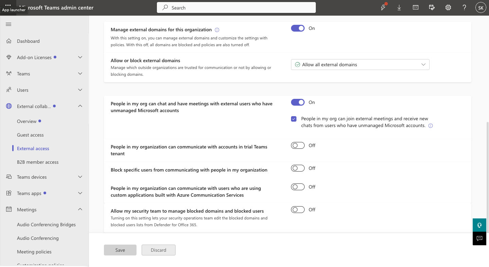
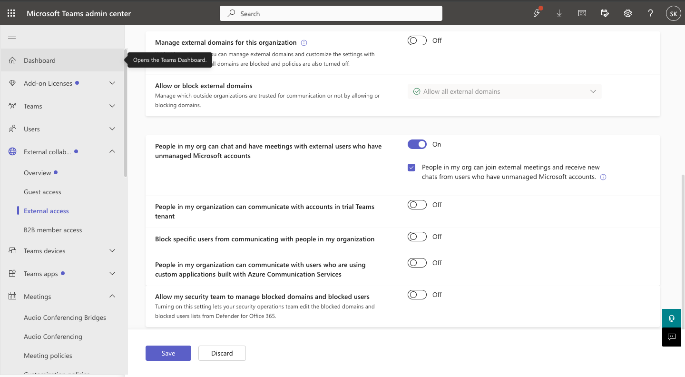
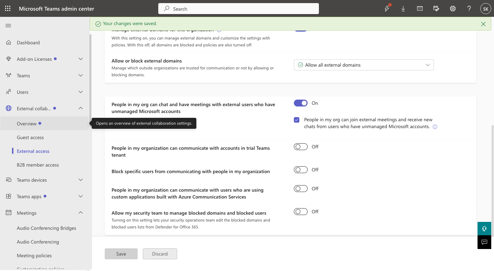

# TEAM-004 — External User Communication Restricted

## Ticket Summary

| Field | Details |
|---|---|
| Ticket ID | TEAM-004 |
| Service | Microsoft Teams |
| Category | External Access / Federation |
| Priority | Medium |
| Status | Resolved |

## Issue

Users were unable to communicate through Microsoft Teams with users outside the organization.

## Investigation

External collaboration settings were reviewed in the Microsoft Teams admin center.

The issue was reproduced by disabling management of external domains, which blocks external domains and associated external-access policies.

Microsoft Teams PowerShell was used to inspect federation configuration.

During the affected state:

`AllowFederatedUsers = False`

This confirmed that external Teams federation had been restricted.

## Root Cause

External communication was restricted by the tenant's Teams federation configuration.

## Resolution

External access was restored and external domain communication was re-enabled.

## Verification

PowerShell verification confirmed:

`AllowFederatedUsers = True`

The investigation was closed as resolved.

## Evidence

## Support Skills Demonstrated

- Teams external access administration
- Federation troubleshooting
- Tenant configuration analysis
- Microsoft Teams PowerShell
- External collaboration support
