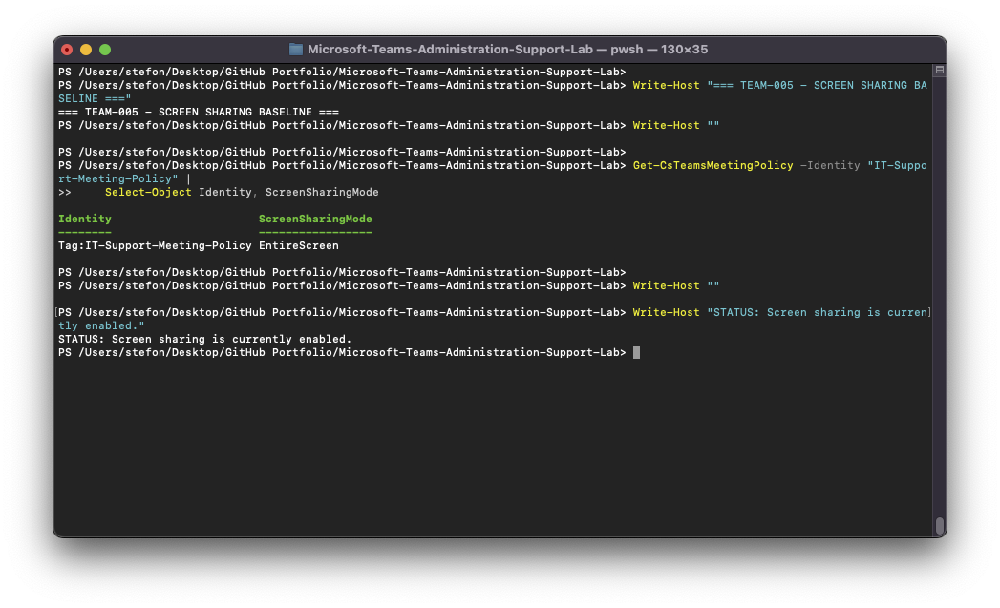
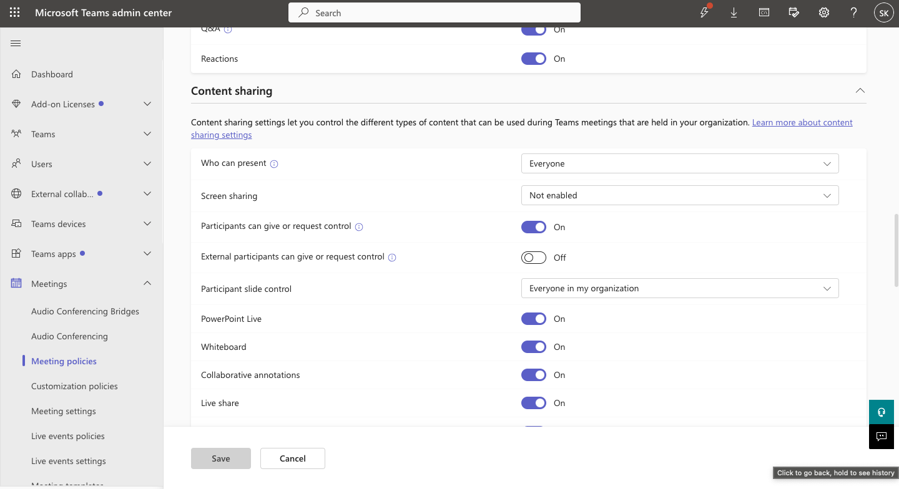
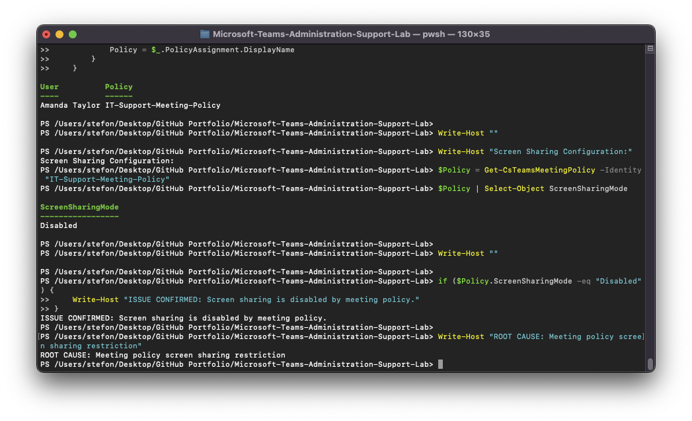
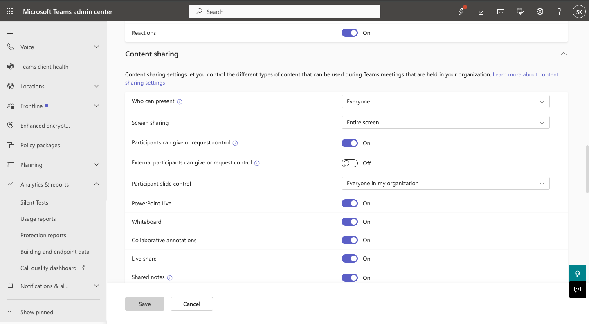

# TEAM-005 — Screen Sharing Disabled During Teams Meetings

## Ticket Summary

| Field | Details |
|---|---|
| Ticket ID | TEAM-005 |
| User | Amanda Taylor |
| Service | Microsoft Teams |
| Category | Meeting Policy / Content Sharing |
| Priority | Medium |
| Status | Resolved |

## Issue

Amanda Taylor was unable to share her screen during Microsoft Teams meetings.

## Investigation

The assigned `IT-Support-Meeting-Policy` was inspected.

The normal baseline showed:

`ScreenSharingMode = EntireScreen`

The issue was reproduced by changing screen sharing to disabled.

PowerShell verification then returned:

`ScreenSharingMode = Disabled`

Amanda Taylor was confirmed to be assigned the affected meeting policy.

## Root Cause

Screen sharing had been disabled in Amanda Taylor's assigned Teams meeting policy.

## Resolution

Screen sharing was restored to `Entire screen` in the custom meeting policy.

## Verification

Post-remediation verification confirmed:

- User: Amanda Taylor
- Meeting policy: `IT-Support-Meeting-Policy`
- Screen sharing mode: `EntireScreen`
- Status: Resolved

## Evidence

## Support Skills Demonstrated

- Teams meeting policy troubleshooting
- Content sharing administration
- Policy assignment validation
- Microsoft Teams PowerShell
- User-impact troubleshooting
