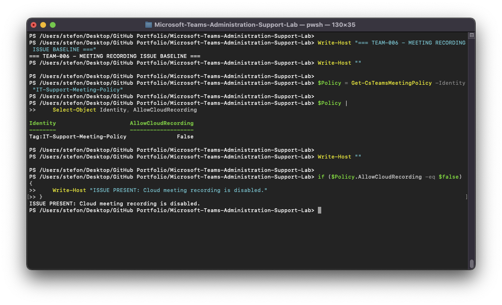
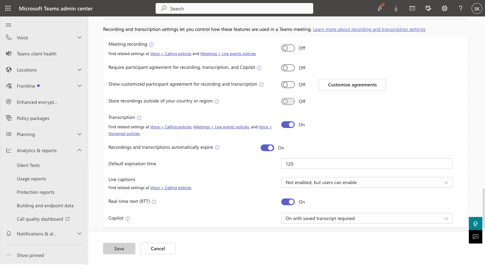
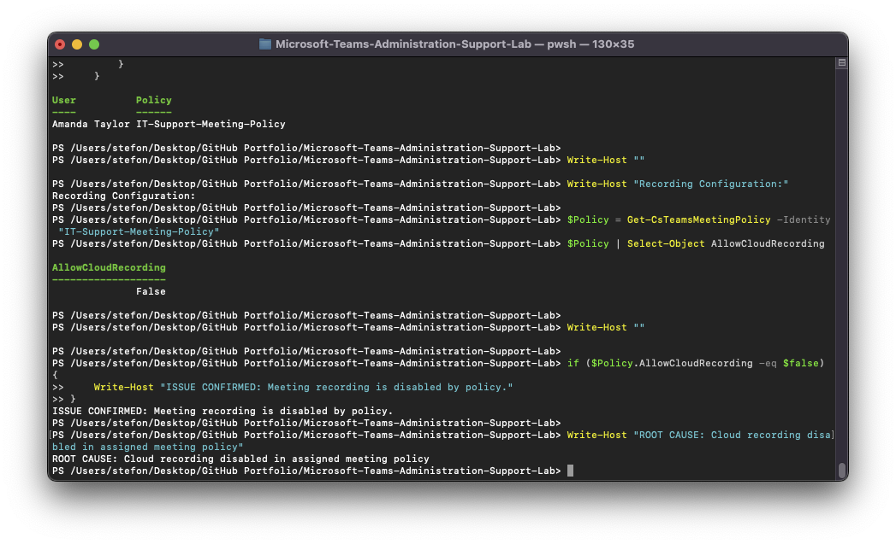
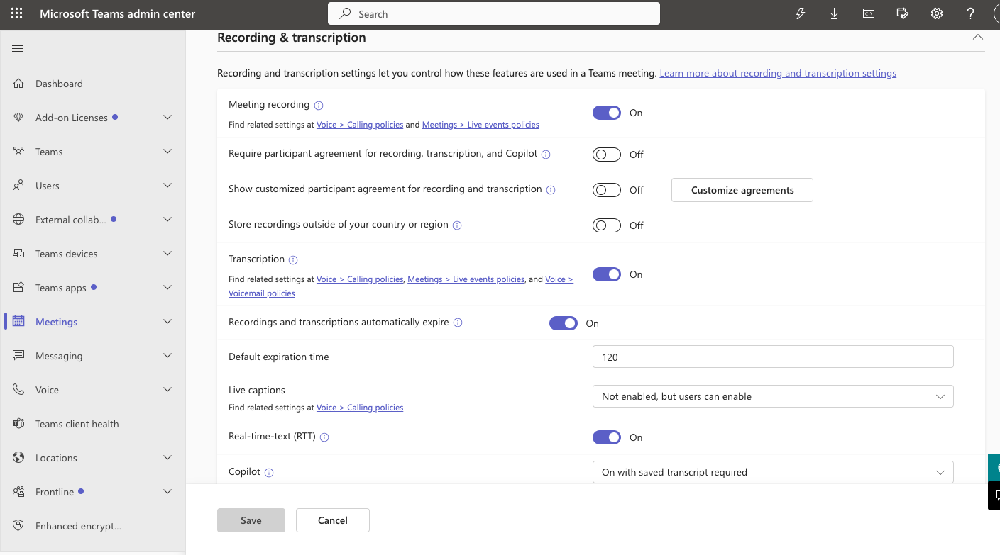
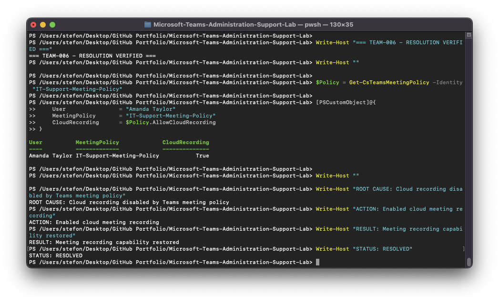

# TEAM-006 — User Cannot Record Microsoft Teams Meetings

## Ticket Summary

| Field | Details |
|---|---|
| Ticket ID | TEAM-006 |
| User | Amanda Taylor |
| Service | Microsoft Teams |
| Category | Meeting Recording |
| Priority | Medium |
| Status | Resolved |

## Issue

Amanda Taylor was unable to record Microsoft Teams meetings.

## Investigation

The assigned `IT-Support-Meeting-Policy` was reviewed.

PowerShell showed:

`AllowCloudRecording = False`

The Microsoft Teams admin center confirmed that the meeting recording setting was disabled.

Amanda Taylor's effective meeting policy was also verified to ensure that the affected configuration applied to her account.

## Root Cause

Cloud meeting recording was disabled in Amanda Taylor's assigned Teams meeting policy.

## Resolution

Meeting recording was enabled in the `IT-Support-Meeting-Policy`.

## Verification

PowerShell confirmed:

- User: Amanda Taylor
- Policy: `IT-Support-Meeting-Policy`
- Cloud recording: `True`
- Status: Resolved

## Evidence

## Support Skills Demonstrated

- Meeting recording administration
- Teams meeting policy troubleshooting
- Effective policy validation
- Microsoft Teams PowerShell
- Configuration remediation
