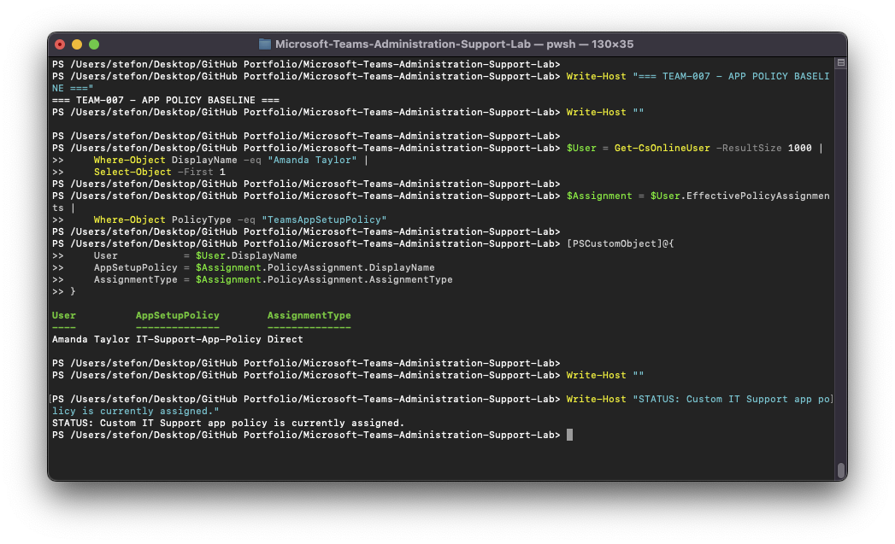
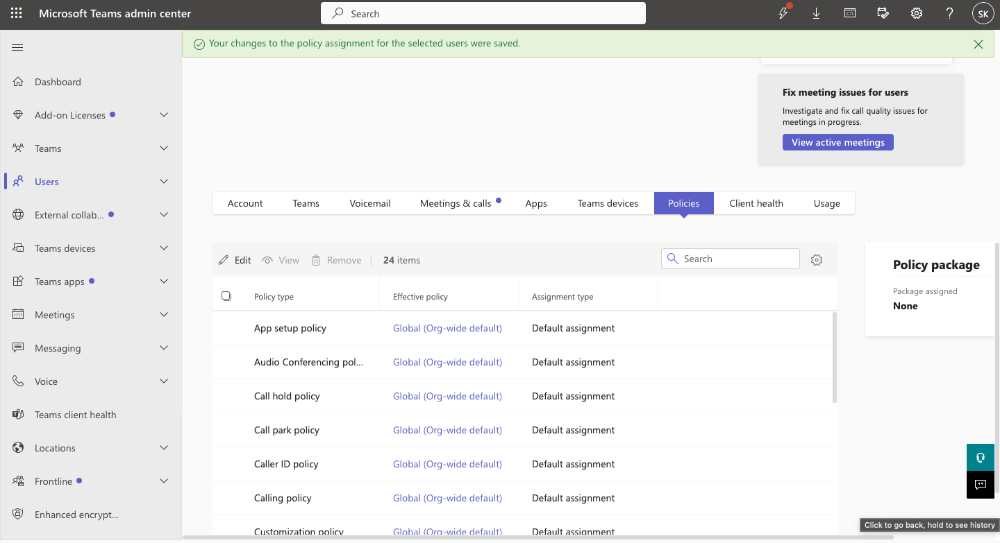
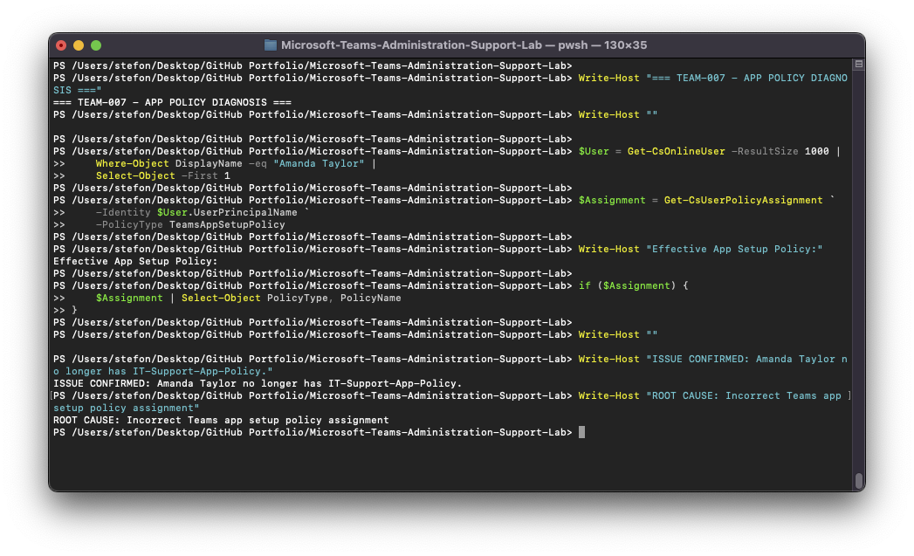
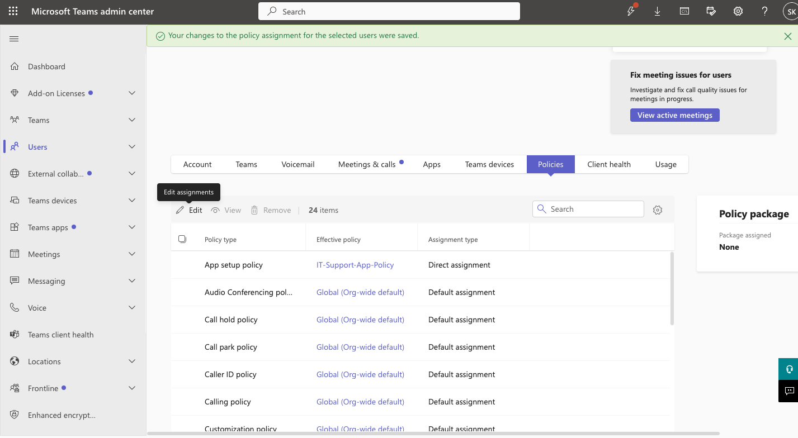

# TEAM-007 — Incorrect Teams App Setup Policy Assigned

## Ticket Summary

| Field | Details |
|---|---|
| Ticket ID | TEAM-007 |
| User | Amanda Taylor |
| Service | Microsoft Teams |
| Category | Teams Apps / Policy Assignment |
| Priority | Medium |
| Status | Resolved |

## Issue

Amanda Taylor was no longer receiving the organization's custom Teams app configuration.

## Investigation

The initial baseline confirmed that Amanda Taylor had:

- App setup policy: `IT-Support-App-Policy`
- Assignment type: `Direct`

The direct custom assignment was removed, causing Amanda to fall back to the Global organization-wide app setup policy.

`Get-CsUserPolicyAssignment` was used to inspect the effective policy state.

During the affected state, no direct `IT-Support-App-Policy` assignment was returned.

## Root Cause

Amanda Taylor's custom Teams app setup policy assignment had been removed, causing her to use the Global policy.

## Resolution

`IT-Support-App-Policy` was reassigned directly to Amanda Taylor.

## Verification

PowerShell confirmed:

- Policy type: `TeamsAppSetupPolicy`
- Policy name: `IT-Support-App-Policy`
- Status: Resolved

## Evidence

## Support Skills Demonstrated

- Teams app setup policies
- Effective policy troubleshooting
- Direct versus Global policy assignments
- Microsoft Teams PowerShell
- User policy remediation
