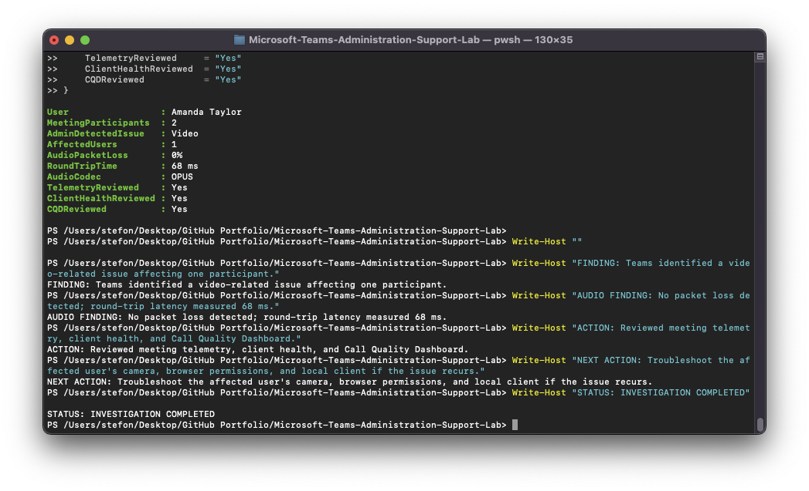

# TEAM-009 — Microsoft Teams Call Quality Investigation

## Ticket Summary

| Field | Details |
|---|---|
| Ticket ID | TEAM-009 |
| User | Amanda Taylor |
| Service | Microsoft Teams |
| Category | Meeting Quality / Diagnostics |
| Priority | Medium |
| Status | Investigation Completed |

## Issue

A Microsoft Teams meeting was reviewed after a reported call-quality concern.

The objective was to determine whether the issue was related to Teams service quality, network performance, audio transport, video, or the local client.

## Investigation

The completed meeting contained two participants.

Teams meeting diagnostics identified a video-related issue affecting one participant.

Detailed meeting telemetry was reviewed.

### Audio Findings

The available audio telemetry showed:

- Packet loss: `0%`
- Round-trip time: `68 ms`
- Audio codec: `OPUS`

These values did not indicate packet loss within the captured audio stream.

## Additional Diagnostics

The following administrative tools were also reviewed:

- Teams meeting diagnostics
- Participant telemetry
- Teams Client Health
- Microsoft Call Quality Dashboard

The Call Quality Dashboard had populated tenant call-quality information and was reviewed as part of the investigation.

## Finding

Microsoft Teams identified a video-related issue affecting one participant.

The captured audio telemetry did not show packet loss.

## Recommended Next Action

If the video problem recurs, continue troubleshooting the affected user's:

- Camera
- Browser permissions
- Local Teams client
- Operating system device permissions
- Local network conditions

## Status

`INVESTIGATION COMPLETED`

## Evidence

## Support Skills Demonstrated

- Teams meeting diagnostics
- Participant telemetry analysis
- Call Quality Dashboard
- Client Health analysis
- Audio and video troubleshooting
- Evidence-based incident investigation
