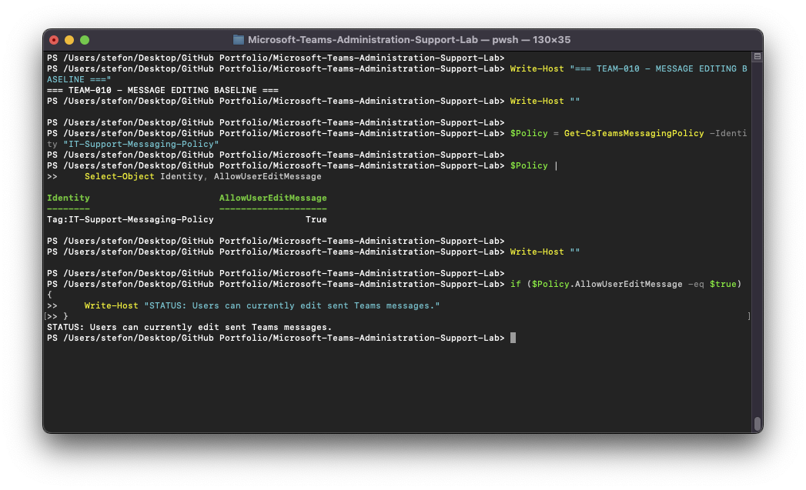
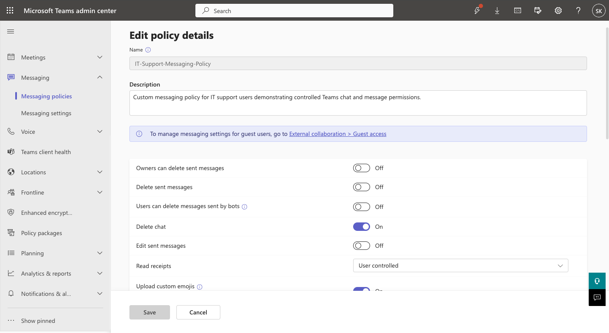
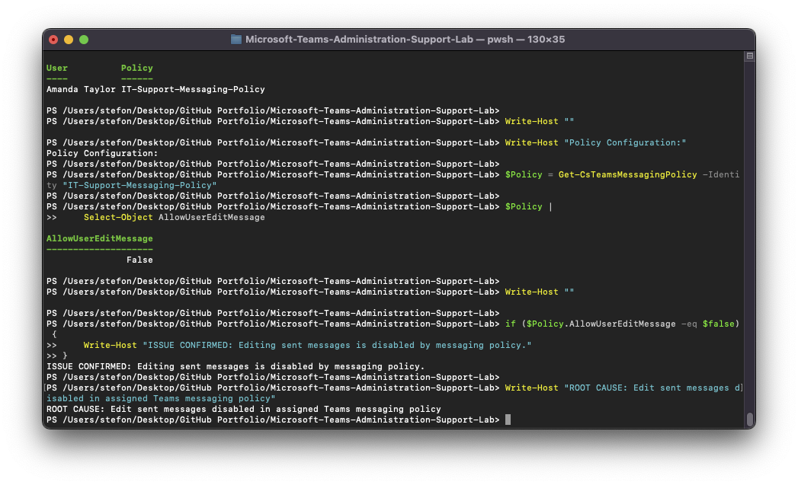
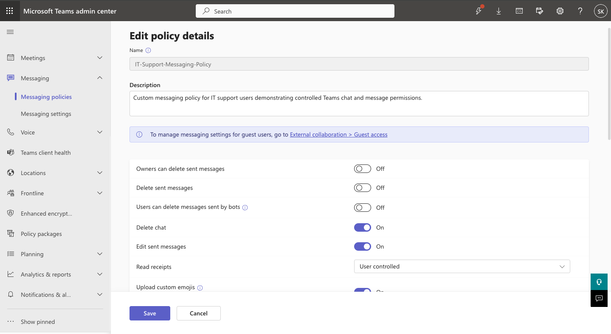

# TEAM-010 — User Cannot Edit Sent Teams Messages

## Ticket Summary

| Field | Details |
|---|---|
| Ticket ID | TEAM-010 |
| User | Amanda Taylor |
| Service | Microsoft Teams |
| Category | Messaging Policy |
| Priority | Medium |
| Status | Resolved |

## Issue

Amanda Taylor was unable to edit messages after sending them in Microsoft Teams.

## Investigation

The assigned `IT-Support-Messaging-Policy` was inspected.

The normal baseline showed:

`AllowUserEditMessage = True`

The issue was reproduced by disabling the `Edit sent messages` setting.

PowerShell then confirmed:

`AllowUserEditMessage = False`

Amanda Taylor was also verified as using the `IT-Support-Messaging-Policy`.

## Root Cause

Editing sent messages was disabled in Amanda Taylor's assigned Teams messaging policy.

## Resolution

`Edit sent messages` was re-enabled in the custom messaging policy.

## Verification

PowerShell confirmed:

- User: Amanda Taylor
- Messaging policy: `IT-Support-Messaging-Policy`
- Edit sent messages: `True`
- Status: Resolved

## Evidence

## Support Skills Demonstrated

- Teams messaging policy administration
- User policy validation
- Microsoft Teams PowerShell
- Messaging feature troubleshooting
- Configuration remediation
