# Microsoft Teams Administration & Support Lab

Hands-on Microsoft Teams administration and troubleshooting lab demonstrating Team and channel management, messaging and 
meeting policies, guest and external access, app setup policies, PowerShell administration, meeting diagnostics, device 
troubleshooting, call quality analysis, and ten documented support incidents.

---

## Project Overview

This project simulates common responsibilities performed by Microsoft 365 Help Desk, Technical Support, and Microsoft Teams 
administrators.

The lab combines administrative configuration with realistic troubleshooting scenarios using:

- Microsoft Teams Admin Center
- Microsoft Entra ID
- Microsoft Teams Web Client
- Microsoft Teams PowerShell
- Teams meeting diagnostics
- Teams Client Health
- Call Quality Dashboard
- Browser and device troubleshooting

Rather than only configuring Teams features, the project documents both normal administrative states and controlled failure 
scenarios with diagnosis, remediation, and post-resolution verification.

---

## Environment

| Component | Purpose |
|---|---|
| Microsoft 365 Tenant | Primary cloud environment |
| Microsoft Teams Admin Center | Teams, users, policies, apps, meetings, devices, and diagnostics |
| Microsoft Entra ID | User and guest identity administration |
| Microsoft Teams Web Client | End-user testing |
| PowerShell 7.6.3 | Command-line administration |
| MicrosoftTeams 7.9.0 | Teams PowerShell module |
| Google Chrome | Teams and Microsoft 365 web administration |
| macOS | Administrative workstation |
| Git / GitHub | Version control and portfolio documentation |

---

## Lab Architecture

```text
Microsoft 365 Tenant
        |
        +-- Microsoft Entra ID
        |       |
        |       +-- Internal Users
        |       +-- Guest User
        |
        +-- Microsoft Teams
        |       |
        |       +-- Teams / Channels
        |       +-- Owners / Members / Guests
        |       +-- Messaging Policies
        |       +-- Meeting Policies
        |       +-- App Setup Policies
        |       +-- Guest Access
        |       +-- External Access
        |
        +-- Teams Diagnostics
        |       |
        |       +-- Meetings & Calls
        |       +-- Participant Telemetry
        |       +-- Client Health
        |       +-- Call Quality Dashboard
        |
        +-- Microsoft Teams PowerShell
                |
                +-- Users
                +-- Teams
                +-- Channels
                +-- Membership
                +-- Policies
                +-- Guest Access
                +-- Federation
                +-- Troubleshooting Verification
```

---

## Key Skills Demonstrated

- Microsoft Teams Administration
- Microsoft 365 Administration
- Microsoft Entra ID
- Microsoft Teams Admin Center
- Microsoft Teams PowerShell
- Team and Channel Management
- Owner and Member Administration
- Private Channels
- Messaging Policies
- Meeting Policies
- App Setup Policies
- Guest Access
- External Access
- Teams Federation
- Meeting Diagnostics
- Participant Telemetry
- Teams Client Health
- Call Quality Dashboard
- Audio / Video Troubleshooting
- Browser Permission Troubleshooting
- Effective Policy Analysis
- Root-Cause Analysis
- Help Desk Troubleshooting
- Technical Documentation
- Git and GitHub

---

# Lab Sections

## 01 — Environment Setup

Established and verified the Microsoft Teams administration environment.

Key tasks included:

- Verified PowerShell 7.6.3
- Verified MicrosoftTeams 7.9.0
- Connected to Microsoft Teams through PowerShell
- Confirmed tenant connectivity
- Reviewed Teams Admin Center
- Inventoried Teams users
- Inventoried existing Teams

[View Environment Setup Documentation](Documentation/01-Environment-Setup.md)


---

## 02 — Teams & Channel Administration

Administered the IT department Team and its collaboration structure.

Tasks included:

- Reviewed existing Teams
- Reviewed Team owners and members
- Reviewed Team settings
- Reviewed private channel membership
- Created `Network Operations` standard channel
- Added Amanda Taylor as a Team member
- Verified configuration through PowerShell

[View Teams & Channel Documentation](Documentation/02-Teams-Channel-Administration.md)


---

## 03 — Messaging Policies

Created and assigned a custom messaging policy:

```text
IT-Support-Messaging-Policy
```

Configured controls included:

- Chat
- Edit sent messages
- Delete sent messages
- Read receipts

The policy was assigned directly to Amanda Taylor and verified through PowerShell.

[View Messaging Policy Documentation](Documentation/03-Messaging-Policies.md)

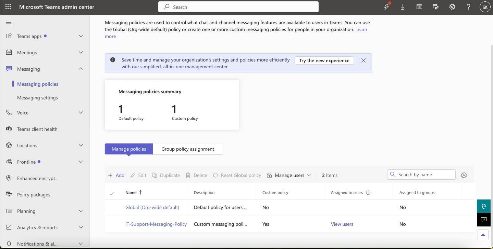

---

## 04 — Meeting Policies

Created and assigned:

```text
IT-Support-Meeting-Policy
```

Configured and tested:

- Private meeting scheduling
- Screen sharing
- Cloud recording
- Transcription
- Meet Now

The same policy was later used in multiple troubleshooting incidents.

[View Meeting Policy Documentation](Documentation/04-Meeting-Policies.md)


---

## 05 — Guest & External Access

Configured and tested Microsoft Teams collaboration outside the organization.

Tasks included:

- Reviewed external access
- Reviewed tenant guest access
- Created an Entra guest identity
- Added guest user to IT Team
- Verified guest membership
- Verified tenant guest configuration
- Reviewed external federation

[View Guest & External Access Documentation](Documentation/05-Guest-External-Access.md)


---

## 06 — Teams Apps & Permissions

Created:

```text
IT-Support-App-Policy
```

Demonstrated:

- Teams app management
- App setup policies
- Pinned applications
- User pinning
- Direct app policy assignment
- Effective policy verification

[View Teams Apps Documentation](Documentation/06-Teams-Apps-Permissions.md)

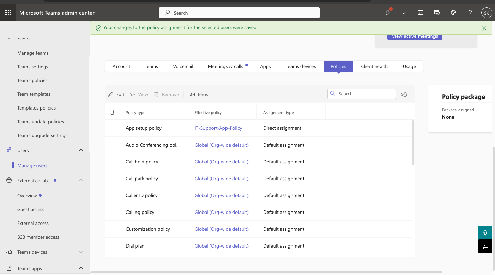

---

## 07 — Meeting Troubleshooting

Created a live two-participant Teams meeting and reviewed it through Microsoft Teams administrative diagnostics.

The investigation included:

- Meeting history
- Meeting details
- Participant telemetry
- Video issue detection
- Audio packet loss
- Round-trip latency
- Audio codec
- Teams Client Health
- Call Quality Dashboard

Captured telemetry included:

```text
Participants: 2
Video issue: 1 affected user
Audio packet loss: 0%
Round-trip time: 68 ms
Audio codec: OPUS
```

[View Meeting Troubleshooting Documentation](Documentation/07-Meeting-Troubleshooting.md)


---

## 08 — Calling & Device Troubleshooting

Investigated a realistic client-side microphone failure.

The issue was reproduced by blocking microphone access in the browser.

Troubleshooting demonstrated:

- Teams device baseline
- Browser site permissions
- User-facing microphone failure
- Permission restoration
- Device verification
- Teams Client Health
- Teams device administration
- Call Quality Dashboard

[View Calling & Device Troubleshooting](Documentation/08-Calling-Device-Troubleshooting.md)

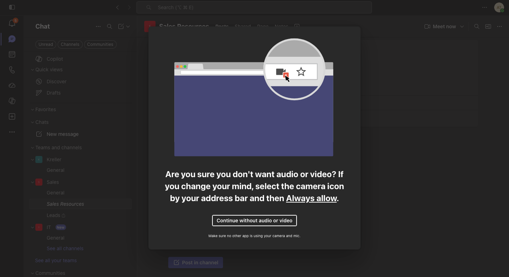

---

## 09 — Microsoft Teams PowerShell

PowerShell was used throughout the project for both administration and troubleshooting.

Representative cmdlets included:

```powershell
Connect-MicrosoftTeams
Get-CsTenant
Get-CsOnlineUser
Get-Team
Get-TeamChannel
Get-TeamUser
Get-CsTeamsMessagingPolicy
Get-CsTeamsMeetingPolicy
Get-CsTeamsAppSetupPolicy
Get-CsUserPolicyAssignment
Get-CsTeamsClientConfiguration
Get-CsTenantFederationConfiguration
```

The final PowerShell administration summary showed:

```text
Teams: 8
Teams Users: 35
Messaging Policy: IT-Support-Messaging-Policy
Meeting Policy: IT-Support-Meeting-Policy
App Setup Policy: IT-Support-App-Policy
Guest Access Enabled: True
```

[View PowerShell Documentation](Documentation/09-Teams-PowerShell.md)

[View Teams Administration Script](Scripts/Teams-Administration.ps1)

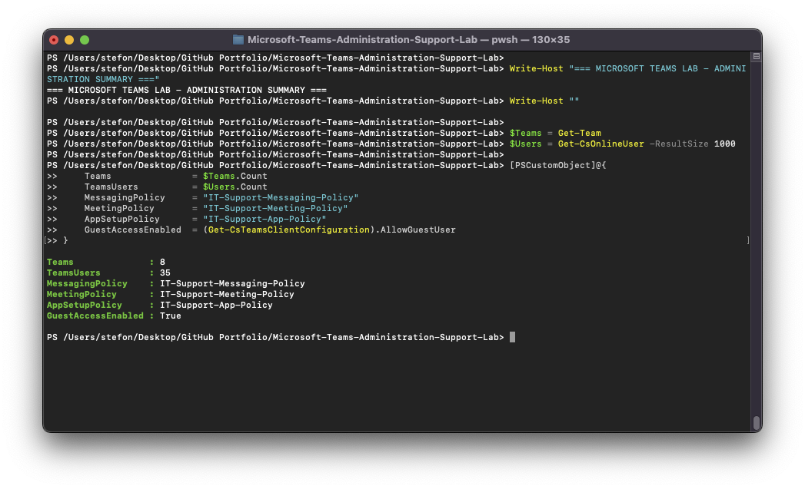

---

## 10 — Support Incidents

Ten Microsoft Teams support scenarios were completed and documented.

[View Support Incident Overview](Documentation/10-Support-Incidents.md)

---

# Help Desk Tickets

| Ticket | Scenario | Root Cause / Finding | Status |
|---|---|---|---|
| [TEAM-001](Help-Desk-Tickets/TEAM-001-Team-Access-Missing.md) | User missing Team access | Missing IT Team membership | 
Resolved |
| [TEAM-002](Help-Desk-Tickets/TEAM-002-Meeting-Scheduling-Disabled.md) | User cannot schedule private meeting | Meeting 
scheduling disabled by policy | Resolved |
| [TEAM-003](Help-Desk-Tickets/TEAM-003-Guest-Access-Disabled.md) | Guest cannot access Teams | Tenant guest access disabled 
| Resolved |
| [TEAM-004](Help-Desk-Tickets/TEAM-004-External-Chat-Restricted.md) | External communication unavailable | Teams federation 
disabled | Resolved |
| [TEAM-005](Help-Desk-Tickets/TEAM-005-Screen-Sharing-Disabled.md) | User cannot share screen | Screen sharing disabled by 
meeting policy | Resolved |
| [TEAM-006](Help-Desk-Tickets/TEAM-006-Meeting-Recording-Disabled.md) | User cannot record meeting | Cloud recording 
disabled by policy | Resolved |
| [TEAM-007](Help-Desk-Tickets/TEAM-007-Incorrect-App-Policy.md) | Wrong app setup experience | Direct app policy assignment 
removed | Resolved |
| [TEAM-008](Help-Desk-Tickets/TEAM-008-Microphone-Permission-Issue.md) | Microphone unavailable | Browser microphone 
permission blocked | Resolved |
| [TEAM-009](Help-Desk-Tickets/TEAM-009-Call-Quality-Investigation.md) | Meeting quality investigation | Video issue 
identified for one participant | Investigation Completed |
| [TEAM-010](Help-Desk-Tickets/TEAM-010-Message-Editing-Disabled.md) | User cannot edit messages | Message editing disabled 
by policy | Resolved |

---

# Troubleshooting Highlights

## Team Access

Amanda Taylor was removed from the IT Team.

PowerShell confirmed missing membership.

Access was restored by adding her back as:

```text
Member
```

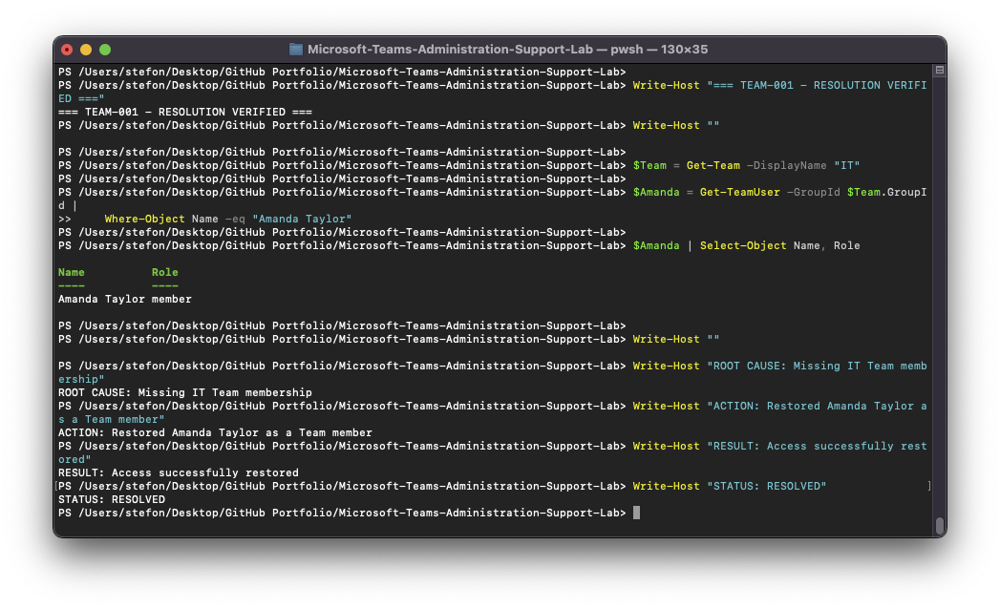

---

## Meeting Scheduling

Private meeting scheduling was disabled through the custom meeting policy.

PowerShell demonstrated:

```text
AllowPrivateMeetingScheduling
True -> False -> True
```

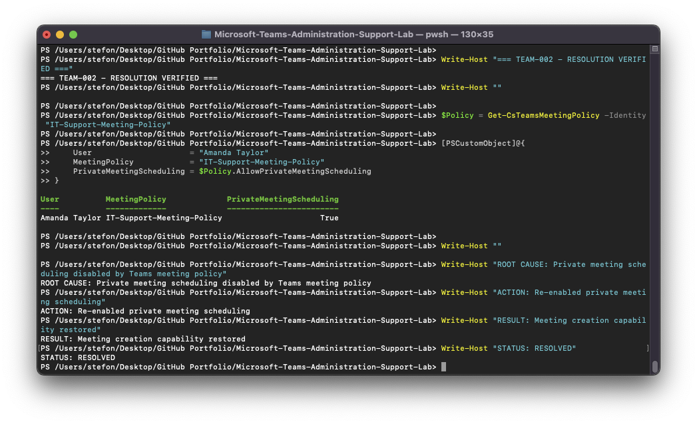

---

## Guest Access

Tenant guest access was intentionally disabled.

PowerShell demonstrated:

```text
AllowGuestUser
True -> False -> True
```

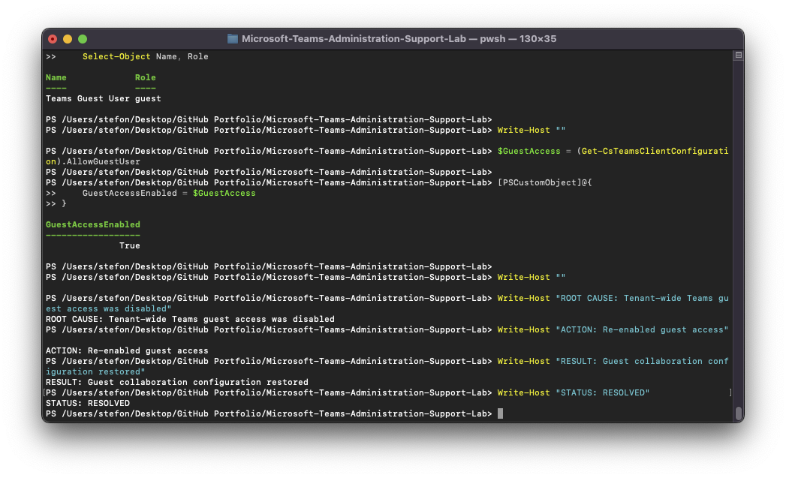

---

## External Teams Communication

Teams federation was restricted.

PowerShell demonstrated:

```text
AllowFederatedUsers
True -> False -> True
```

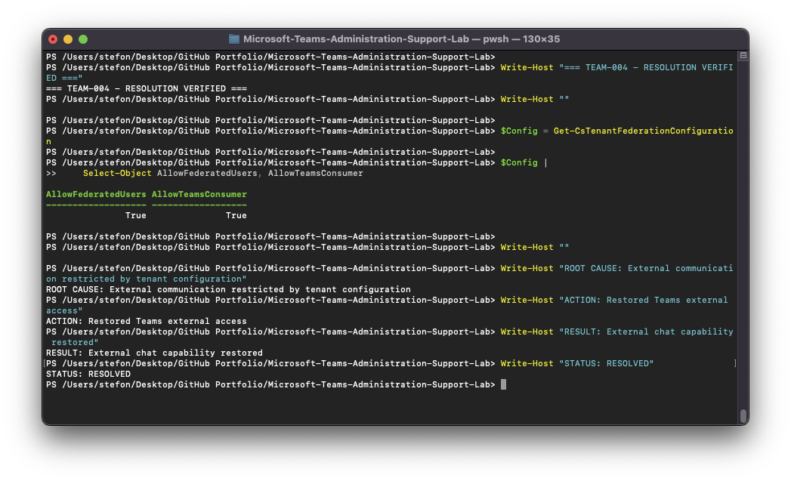

---

## Screen Sharing

The custom meeting policy was changed from:

```text
EntireScreen
```

to:

```text
Disabled
```

and then restored.

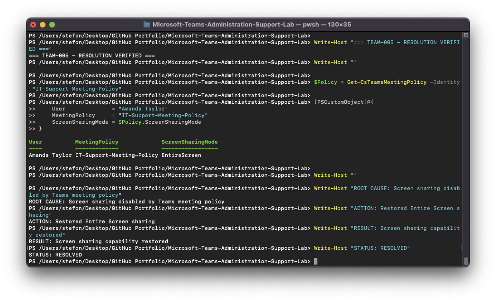

---

## Meeting Recording

Cloud recording was disabled in Amanda Taylor's assigned meeting policy.

The final state showed:

```text
CloudRecording = True
```


---

## App Policy Assignment

Amanda Taylor's direct custom app setup policy was removed, causing fallback to the Global policy.

The custom policy was restored:

```text
IT-Support-App-Policy
```

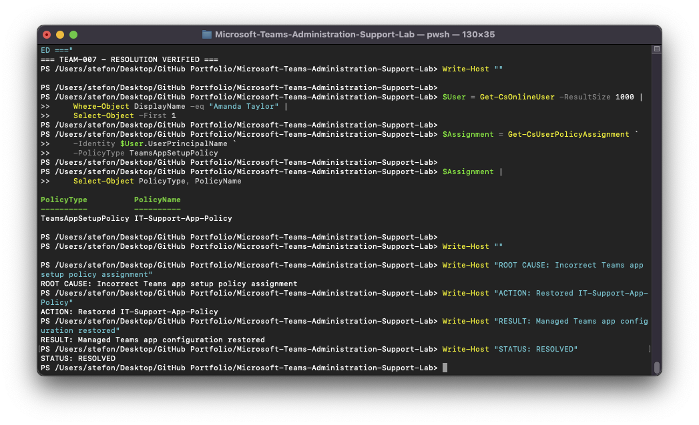

---

## Microphone Troubleshooting

The user's browser microphone permission was blocked.

Teams reproduced the end-user issue.

The permission was restored and the device became available again.

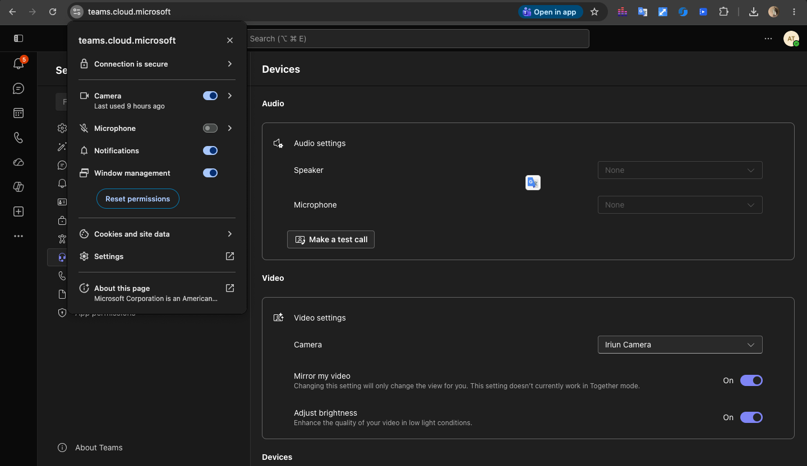

---

## Meeting Quality Investigation

Teams diagnostics identified a video issue affecting one participant.

Audio telemetry showed:

```text
Packet loss: 0%
Round-trip time: 68 ms
Audio codec: OPUS
```


---

## Messaging Policy Troubleshooting

Editing sent messages was disabled and later restored.

PowerShell demonstrated:

```text
AllowUserEditMessage
True -> False -> True
```

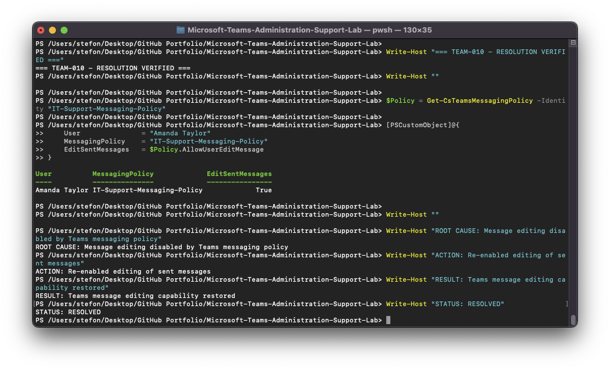

---

# Repository Structure

```text
Microsoft-Teams-Administration-Support-Lab/
|
+-- README.md
|
+-- Documentation/
|   +-- 01-Environment-Setup.md
|   +-- 02-Teams-Channel-Administration.md
|   +-- 03-Messaging-Policies.md
|   +-- 04-Meeting-Policies.md
|   +-- 05-Guest-External-Access.md
|   +-- 06-Teams-Apps-Permissions.md
|   +-- 07-Meeting-Troubleshooting.md
|   +-- 08-Calling-Device-Troubleshooting.md
|   +-- 09-Teams-PowerShell.md
|   +-- 10-Support-Incidents.md
|
+-- Help-Desk-Tickets/
|   +-- TEAM-001-Team-Access-Missing.md
|   +-- TEAM-002-Meeting-Scheduling-Disabled.md
|   +-- TEAM-003-Guest-Access-Disabled.md
|   +-- TEAM-004-External-Chat-Restricted.md
|   +-- TEAM-005-Screen-Sharing-Disabled.md
|   +-- TEAM-006-Meeting-Recording-Disabled.md
|   +-- TEAM-007-Incorrect-App-Policy.md
|   +-- TEAM-008-Microphone-Permission-Issue.md
|   +-- TEAM-009-Call-Quality-Investigation.md
|   +-- TEAM-010-Message-Editing-Disabled.md
|
+-- Screenshots/
|   +-- 01-Environment/
|   +-- 02-Teams-Channels/
|   +-- 03-Messaging-Policies/
|   +-- 04-Meeting-Policies/
|   +-- 05-Guest-External-Access/
|   +-- 06-Apps/
|   +-- 07-Meetings/
|   +-- 08-Calling-Devices/
|   +-- 09-PowerShell/
|   +-- 10-Troubleshooting/
|
+-- Scripts/
    +-- Teams-Administration.ps1
```

---

# Screenshot Evidence

The repository contains:

```text
100 screenshots
```

organized across ten evidence categories.

The screenshots document:

- Environment baselines
- Teams administration
- Channel administration
- Messaging policies
- Meeting policies
- Guest access
- External access
- Teams apps
- PowerShell
- Device troubleshooting
- Meeting diagnostics
- Incident troubleshooting
- Post-remediation verification

---

# Troubleshooting Methodology

The support scenarios followed a consistent process:

```text
1. Identify the user-reported symptom
2. Determine the affected service and scope
3. Review the current configuration
4. Reproduce or confirm the failure
5. Use Teams Admin Center and/or PowerShell to diagnose
6. Identify the root cause or supported finding
7. Apply the smallest appropriate remediation
8. Re-query or retest the configuration
9. Verify restored functionality
10. Document the outcome
```

This workflow avoided unrelated changes and produced clear evidence of both failure and resolution states.

---

# Final Lab Results

The project completed:

- 10 administration documentation files
- 10 Microsoft Teams support tickets
- 100 screenshots
- 1 reusable Teams PowerShell administration script
- 3 custom Teams policies
- Guest identity and Team membership
- External federation testing
- Standard and private channel administration
- Teams meeting diagnostics
- Client Health review
- Call Quality Dashboard analysis
- Browser/device troubleshooting
- PowerShell-based remediation verification

Custom policies created:

```text
IT-Support-Messaging-Policy
IT-Support-Meeting-Policy
IT-Support-App-Policy
```

Final environment summary:

```text
Microsoft Teams: 8
Teams Users: 35
Guest Access: Enabled
IT Team: Private
Custom Messaging Policy: Configured
Custom Meeting Policy: Configured
Custom App Setup Policy: Configured
```

---

# Portfolio Value

This project demonstrates experience with Microsoft Teams beyond basic Team creation.

It provides hands-on evidence of:

- Enterprise-style Microsoft Teams administration
- User and membership management
- Policy-based access and feature controls
- Microsoft Entra guest collaboration
- External Teams federation
- Microsoft Teams PowerShell
- End-user support
- Audio and video troubleshooting
- Meeting diagnostics
- Call quality investigation
- Root-cause analysis
- Post-remediation verification
- Help desk ticket documentation

The project is designed to demonstrate skills relevant to roles such as:

- IT Support Specialist
- Help Desk Analyst
- Microsoft 365 Support Technician
- Microsoft Teams Support Technician
- Desktop Support Technician
- Technical Support Specialist
- Junior Microsoft 365 Administrator

---

## Repository

**Microsoft Teams Administration & Support Lab**

Built as part of a hands-on IT support and Microsoft 365 administration portfolio.
